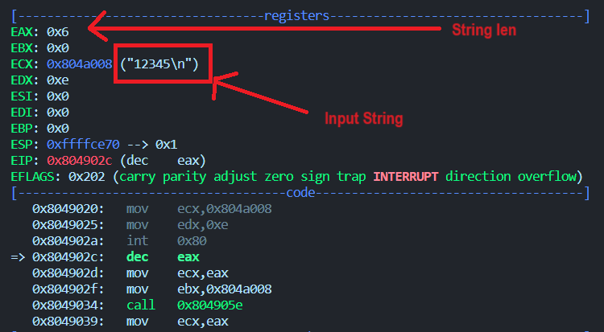
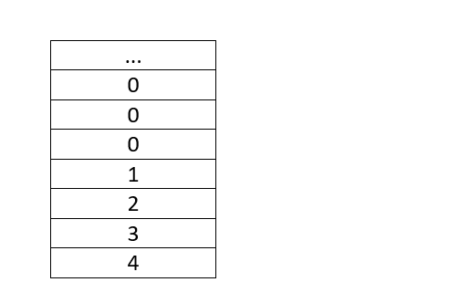
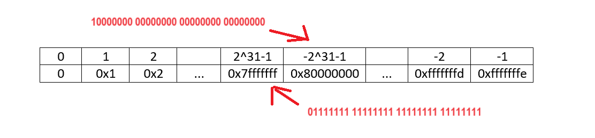

# NASM

## DESCRIPT

- Các task này đều đơn giản về mặt xử lí nên mình chỉ giải thích cách xử lý chương trình như nhập, xuất, xử lý bigNum, xử lý số âm, lưu giá trị của mảng.

### String to number

- Vấn đề đầu tiên cần giải quyết với các bài toán yêu cầu input là xử lý chuỗi thành số. khi nhập đầu vào với syscall, thứ được truyền vào là chuỗi kí tự.

  

- Ta với các kí tự digit '0'-'9' nằm trong khoảng 0x30-0x39, ta convert từ chuỗi số sang số nguyên bằng cách tách từng phần tử của chuỗi, trừ đi `0x30` và nhân dần với `0xa` trước bước lặp để thêm vào digit tiếp theo.

```asm
mov ecx, eax
mov ebx, num1
_stringToNum: ;ARGS(len(ECX) inputString(EBX))
    xor edx, edx
    xor eax, eax
    xor esi, esi
    stringToNumWorker:
        mov edx, 10
        mul edx
        mov dl, [ebx + esi]
        sub edx, 0x30
        add eax, edx
        inc esi
    loop stringToNumWorker
ret
```

### Number to string

- Ta biết rằng syscall_print cho phép ta in ra mã ascii của giá trị được truyền vào `ecx`. Giả sử ta cần in giá trị trong một biến `ans = 0x2`, nếu không thực hiện chuyển đổi từ digit sang kí tự trước khi in mà truyền `ans` vào `ecx`, máy tính thực hiện in ra giá trị trong bảng mã ascii tương đương với 0x2 mà không phải kí tự `2`.

- Để giải quyết vấn đề này, ta làm ngược lại công đoạn convert stringToNum. Lấy ra từng đơn vị, cộng với `0x30` và đẩy vào stack, sau đó `pop` chúng ra và đưa vào 1 biến. Thực hiện in chúng ra với biến lưu từng digits.

- Có một lưu ý ở đây là việc `push` một thanh ghi vào stack có thể xảy ra xung đột nếu ta `pop` khi thanh ghi đó đang không ở trên cùng stack, việc đó có thể sử dụng debugger để soát lỗi.

```asm
_numToString: ;ARGS(int(EAX))
    mov ecx, 0
    execute:
        xor edx, edx
        mov ebx, 10
        div ebx
        add edx, 0x30
        push edx
        inc ecx
    cmp eax, 0
    jne execute

    mov ebp, 0
    L00P:
        pop edx
        mov [num2 + ebp], edx
        inc ebp
    loop L00P
ret
```

### Count Big Num

- Để thực hiện bài toán Fibonacci khi nhập vào vị trí lớn hơn 50, việc cộng dồn thông thường đã không thỏa mãn yêu cầu. Ta phải thực hiện tính toán cộng thủ công từng đơn vị.
- Đoạn chương trình dưới gồm 3 số được lưu ngược từng digit trong chuỗi, `flag` là biến lưu số nhớ, nếu phép cộng đơn vị lớn hơn `0xa`.

```asm
    ans times 150 db '0'
    pre times 150 db '0'
    sum times 150 db '0'
    flag db 0
```

```asm
_countBigNum: ;
    mov al, 0x31
    mov [ans], al
    xor eax, eax
    xor ebx, ebx
    xor ecx, ecx
    xor edx, edx
    mov esi, 0     ; vị trí đầu

    add_loop:
        mov cl, [flag]
        mov al, [ans + esi]
        mov bl, [pre + esi]
        sub eax, 0x30
        sub ebx, 0x30

        add eax, ebx
        add eax, ecx
        mov ecx, 0xa
        div ecx
        mov [flag], al
        add dl, 0x30
        mov	[sum + esi], dl

        xor edx, edx
    inc	esi
    cmp esi, 0x96
    jne add_loop
ret
```

- Lưu ý rằng sau khi thực thi hàm trên, giá trị của bigNum sẽ lưu ngược. Việc của ta là push vào stack, lọc bỏ các kí tự `0` ở đầu stack rồi lưu các đơn vị còn lại vào 1 biến khác.

### BigNumToString

- Sau khi thực hiện tính toán, chuỗi được lưu trong mảng ans theo dạng:

  

- Ta cần chuẩn hóa nó trước khi in ra, đẩy từng digit vào stack. Sau đó `pop` và lọc bỏ các digit '0' ở đầu.

  

```asm
_bigNumToString:
    xor esi, esi
    xor eax, eax
    toStack:
        mov al, [ans + esi]
        push eax
    inc esi
    cmp esi, 0x96
    jne toStack

    xor esi, esi
    formBigNum:
        pop eax
    inc esi
    cmp eax, 0x30 ; lọc bỏ các digit '0'
    je formBigNum

    xor edi, edi
    mov [num2 + edi], eax

    toNum2:
        inc edi
        pop eax
        mov [num2 + edi], eax
    inc esi
    cmp esi, 0x96
    jne toNum2
ret
```

### StringToNum(với số âm)

- Nếu ta ở bài toán fibonacci, ta không có đầu vào số âm nên hàm convert khá đơn giản. Nhưng với một tình huống tổng quát hơn, khi đầu vào bao gồm cả số âm thì sao?

- Một số âm sẽ đi kèm kí tự `-` ở đầu với giá trị hexa là `0x2d`. Kí tự này cần phải loại bỏ vì không thể trừ cho `0x30` như các digit từ `0-9` khác.

- Đầu tiên, với độ lớn 4 byte, số âm được biểu diễn như nào? Ở trong `C/C++` giá trị một biến `int` có max là 2<sup>31</sup>, 1 bit đầu dùng biểu thị dấu, số âm sẽ được biểu diễn ngược lại với số dương. VD: `0xfffffffe` tương đương với số nguyên `-1`. Từ hình mô tả dưới ta có nhận định rằng số âm `n` là kết quả của phép toán `0xffffffff-abs(n)`.

  

- Bằng những giải thích trên, mình thực hiện lấy giá trị âm như sau. Ý tưởng ở đây là thực hiện kiểm tra kí tự đầu của inputString như dòng lệnh `cmp dl, [minus]` sau khi truyền vào kí tự đầu của chuỗi để xác định có phải kí tự `-` hay không. Nếu là dấu trừ, tăng giá trị biến đếm lên 1 để bỏ qua kí tự đó, thực hiện convert như thông thường và lấy `0xffffffff` trừ đi kết quả được convert thành giá trị âm.

```asm
_stringToNum: ; Numlen: ecx, String: ebx
    xor edx, edx
    xor eax, eax
    xor esi, esi

    mov dl, [ebx + esi]
    cmp dl, [minus]
    jne continu3
    inc esi
    dec ecx
    mov [flag], esi
    continu3:
    L0OP:
        mov edx, 0xa
        mul edx
        mov dl, [ebx + esi]
        sub edx, 0x30
        add eax, edx
    inc esi
    loop L0OP

    mov esi, [flag]
    cmp esi, 0x1
    jne c0ntinu3
        mov ecx, 0xffffffff
        sub ecx, eax
        mov eax, ecx
    c0ntinu3:
    xor esi, esi
ret
```

### Tổng kết

Để hoàn thiện 2 chương trình tính fibonacci và selectionSort bằng nasm x86, ta cần trang bị những kiến thức mình nêu trên cùng với cách sử dụng các công cụ debug. Thêm vào đó là cách ép kiểu hợp lý để lấy dữ liệu mình mong muốn như sử dụng dl, al thay vì các thanh ghi lớn, hơn nữa là ép `dword` để lưu dạng 4 byte...

# Mong WRITEUP này giúp ích cho các bạn!

```
from KMA
Author: 13r_ə_Rɪst
Email: sonvha2k23@cvp.vn
```
