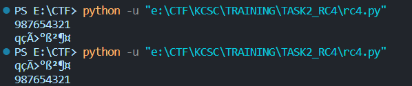
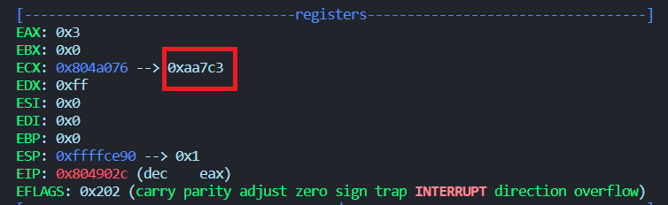

# NASM

## DESCRIPT

- Về task viết chương trình encrypt RC4 này. Nhận định đầu tiên mình đưa ra là chương trình không quá khó để cài đặt. Ở task trước, việc xử lý thủ công việc convert input và output khiến chương trình cần debug kĩ lưỡng hơn thì sau khi hoàn thành task2 giúp mình hiểu được chương trình mã hóa RC4 khi gặp chall tương tự.

- Tuy vậy, chương trình mình cài đặt vẫn gặp một vấn đề nhỏ và cách mình xử lý theo cá nhân mình đánh giá thì vẫn chưa tối ưu lắm. Đó là việc xử lý input, chính xác hơn là chuỗi input.

- Việc đọc giá trị từ bàn phím khá đơn giản để xử lý. Thậm chí ở task này mình cũng không cần xử lý chuỗi đầu vào vì mọi biến đổi đều dựa trên mã `ascii` của từng kí tự, cả `input string` lẫn `key`.

- Dưới đây là chương trình mã hóa RC4 được cài đặt bằng python.

```python
import base64

data = input()
key = "4444"

S = list(range(256))
j = 0
out = ''

# KSA Phase
for i in range(256):
    j = (j + S[i] + ord(key[i % len(key)])) % 256
    S[i], S[j] = S[j], S[i]

# PRGA Phase
i = j = 0
for char in data:
    i = (i + 1) % 256
    j = (j + S[i]) % 256
    S[i], S[j] = S[j], S[i]
    out += chr(ord(char) ^ S[(S[i] + S[j]) % 256])

print(out)
```

- Sau khi cài đặt và thấy chương trình hoạt động ổn, một vấn đề nảy sinh. RC4 là loại mã hóa đối xứng, Tức là `input` được encrypt có thể decrypt bằng chính thuật toán này. Ở chương trình trên, với input là `987654321` ta có encryptedString là `qçÃ>°ß²¶¤` và ngược lại.

  

- Thử chức năng này với chương trình asm. Vấn đề nảy sinh khi input là chuỗi `qçÃ>°ß²¶¤`. Mặc dù đều là các kí tự nhỏ hơn `0xff` khi đổi sang dạng hexa, việc nhập vào của các kí tự không có trong bàn phím lại xuất hiện giá trị không chính xác.

  

- giá trị của kí tự `ç` ở dạng hexa là `0xe7`, nhưng input đã có sự khác biệt. Để chứng minh chương trình được cài đặt là đúng, mình bỏ đi phần nhập input và set các giá trị đầu của chuỗi `data` thành `0x71, 0xe7, 0xc3, 0x3e, 0xb0, 0xdf, 0xb2, 0xb6, 0xa4` với key giữ nguyên là `4444`, ta vẫn thu được output là `987654321` như ban đầu.

### Tổng kết

Dù hoàn thiện phần mã hóa, việc xử lý input lại gặp vấn đề ở các trường hợp đặc biệt, tuy phương án xử lý trên đã giải quyết một phần vấn đề nhưng mình sẽ cập nhật lại chương trình khi tìm ra cách hoàn thiện phần nhập input.

# Mong WRITEUP này giúp ích cho các bạn!

```
from KMA
Author: 13r_ə_Rɪst
Email: sonvha2k23@cvp.vn
```
