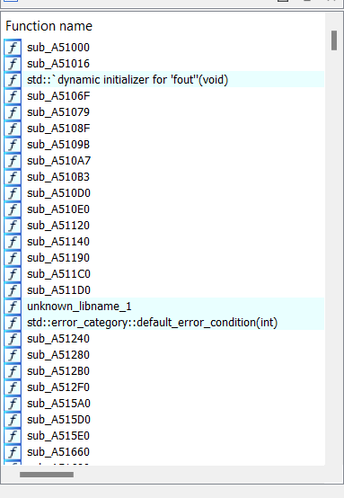
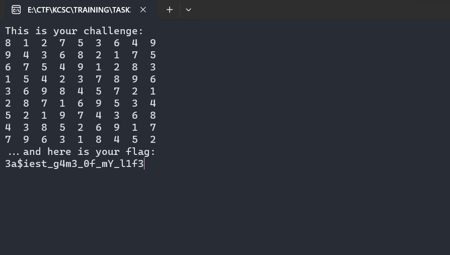

## Task3/RE

## EzSudoku

### Lời giải

- Nhận định về bài này, mình chưa đánh giá được độ khó một cách khách quan. Có thể do mindset chuẩn nên solve khá nhanh.

- Ban đầu mình đánh giá bài này trông khá ngợp vì chương trình được xây dựng bởi rất nhiều hàm :D
  
- Dù không hiểu hết toàn bộ chương trình. Khi mới tiếp xúc với chall này, mình có một số đặc điểm của chall mình rút ra được để xây dựng hướng đi.

  1. Chương trình không có `input` lẫn `argc/argv`. Khi chạy file thực thi, thứ bên dưới là output cố định của nó.
     
  2. Tên đề bài và mục `This is your challenge` cho ta một ma trận `9x9` với một vài ô điền sẵn. Có vể giả thiết gợi ý theo hướng giải ma trận sudoku. Vì ma trận in ra là cố định, mình có suy đoán rằng ma trận được in ra chính là key để mã hóa thành `flag`.

- Với 2 nhận định trên. Mình đã giải ma trận sudoku đó và thực hiện việc thay đổi giá trị khi debug để lấy được `flag`.
  
- Ma trận được in ra sau khi hàm `sub_B91D60()` chạy. Với tham số duy nhất là `v27` Có thể đó là mảng giá trị của ma trận.
  
- Có vẻ chính xác, thực hiện thay đổi các giá trị xem.
  
- Với các giá trị cho sẵn, ma trận sudoku 9x9 có một lời giải duy nhất như sau
  
- Input hàm sub_B91D60() có kiểu dữ liệu DWORD, nên ta sẽ sửa 4 byte một.
  
- Chạy chương trình sau khi sửa dữ liệu ma trận, thu được flag.
  

```
flag: 3a$iest_g4m3_0f_mY_l1f3
```

## Mong WRITEUP này giúp ích cho các bạn!

```
from KMA
Author: 13r_ə_Rɪst
Email: sonvha2k23@cvp.vn
```
