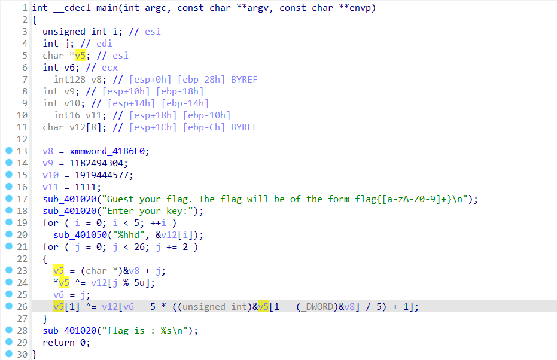
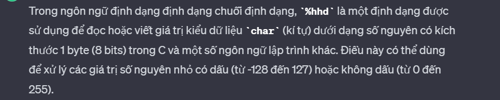

## Task3/RE

## F81E37E841D0B2C1D5738A7D60FD98BE

### Lời giải

- Bài này khá dễ nên mình sẽ không trình bày quá chi tiết :D.

- Load vào `IDA`, ta thấy chương trình khá đơn giản. chương trình gồm các hàm nhập xuất được viết thủ công tương ứng là sub_401050(), sub_401020().

  

- Chương trình yêu cầu ta nhập in `input` gồm 5 `key`. Nếu có gì cần chú ý ở đây thì đó là đặc tả dữ liệu `%hhd`. Theo khái niệm bên dưới, ta có thể dựa vào nó để vét cạn với độ lớn là 128<sup>5</sup> nếu cần thiết.

  

- Về đoạn mã hóa. Mình thấy có một dòng khá khó hiểu bên dưới nên phân tích một chút. Cá nhân mình cũng không rõ đoạn `(j + 1) - 5*(j + 1)/5` cho lắm nhưng trong quá trình debug có đọc liên tục giá trị từ đó ra nên kết luận được rằng nó tương đương với `(j + 1)%5`.

```C
    v5 = &v8 + j;
    v6 = j;
    v5[1] ^= v12[v6 - 5 * ((unsigned int)&v5[1 - (_DWORD)&v8] / 5) +1];

->  v5[1] = v8[j+1] ^ v12[j - 5*(&v8 + j + 1 - &v8)/5 + 1];
->  v5[1] = v8[j+1] ^ v12[j - 5*(j + 1)/5 + 1];
->  v5[1] = v8[j+1] ^ v12[j - 5*(j + 1)/5 +1];
->  v5[1] = v8[j+1] ^ v12[(j + 1) - 5*(j + 1)/5];
->  v5[1] = v8[j+1] ^ v12[(j + 1)%5];
```

- Từ đó ta có chương trình khai thác bằng phương pháp vét cạn như sau.

```python
v8 = "bdnpQai|nufimnug`n{FafhrW  "
flag = ""
for a in range(128):
    for b in range(128):
        for c in range(128):
            for d in range(128):
                for e in range(128):
                    for i in range(24):
                        if i % 2 != 0:
                            continue
                        v5 = [v8[i], v8[i+1]]
                        key = [a, b, c, d, e]
                        v5[0] = chr(ord(v8[i]) ^ key[i % 5])
                        v5[1] = chr(ord(v8[i+1]) ^ key[(i+1) % 5])

                        if v5[0] != 'f':
                            break
                        flag += v5[0]
                        flag += v5[1]
                    print(flag+'\n')
```

- Như đã nói ở trên, thời gian để vét cạn là cực lớn mất khá nhiều thời gian. Đồng thời đề bài cho ta biết format flag là `flag{************}`. Vừa đủ 5 kí tự đầu để suy ngược ra key!

```python
print(ord('f') ^ ord(v8[0]))
print(ord('l') ^ ord(v8[1]))
print(ord('a') ^ ord(v8[2]))
print(ord('g') ^ ord(v8[3]))
print(ord('{') ^ ord(v8[4]))
```

- Chạy đoạn script trên, ta thu được `key`
  

- Hoàn thiện script với `key` vừa thu được.

```python
v8 = "bdnpQai|nufimnug`n{FafhrW  "
flag = ""
for i in range(25):
    if i % 2 != 0:
        continue
    v5 = [v8[i], v8[i+1]]
    key = [4, 8, 15, 23, 42]
    v5[0] = chr(ord(v8[i]) ^ key[i % 5])
    v5[1] = chr(ord(v8[i+1]) ^ key[(i+1) % 5])
    flag += v5[0]
    flag += v5[1]
print(flag)
```

```
flag: flag{easy_baby_challenge}
```

## Mong WRITEUP này giúp ích cho các bạn!

```
from KMA
Author: 13r_ə_Rɪst
Email: sonvha2k23@cvp.vn
```
