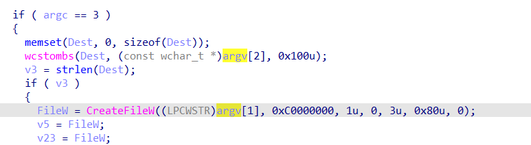
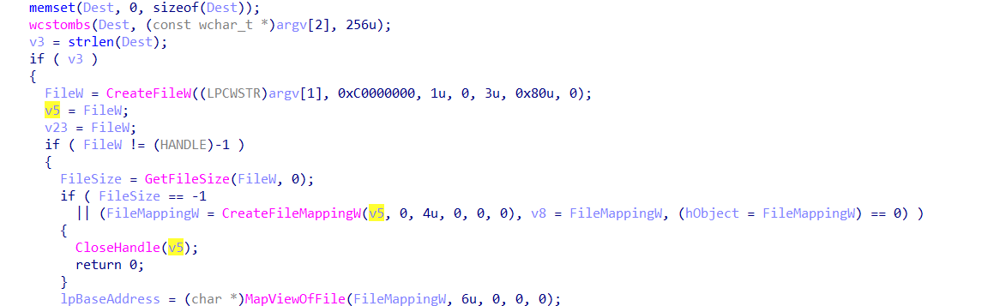
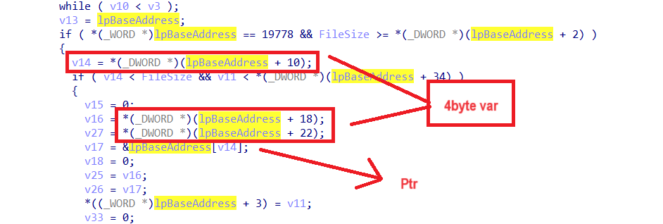
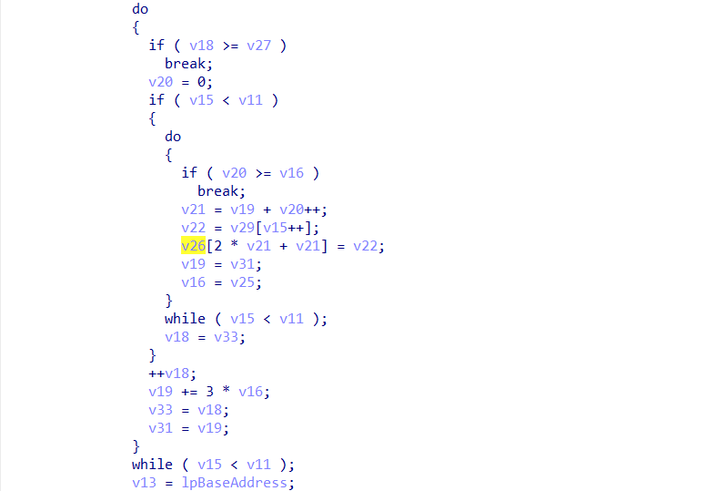
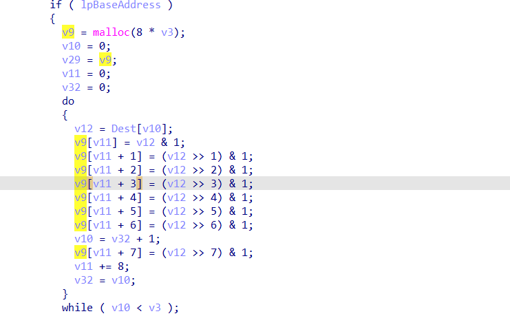
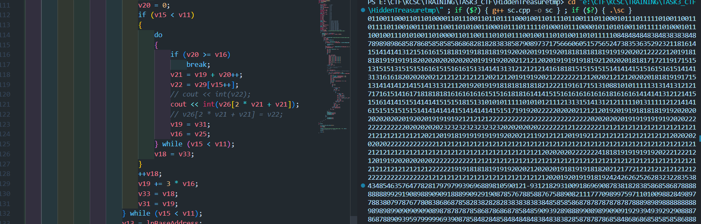
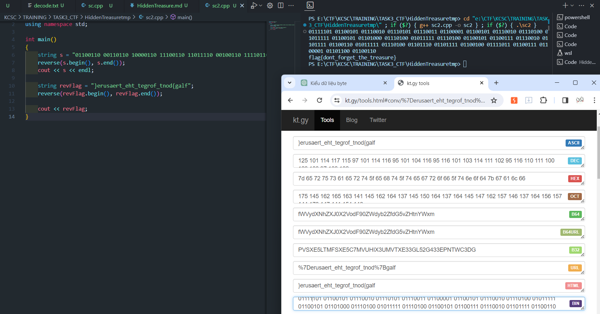

## Task3/RE

## HiddenTreasure

### Lời giải

- Ở Chall này mình thu được kha khá kiến thức về việc thay đổi mã giả thành chương trình `C++` có thể thực thi. Tất nhiên mình có một vài khó khăn khi xử lí Chall này như sau:

1. Không rõ nội dung `input`, Dù thấy được chương trình sử dụng `argv[1]`, `argv[2]`. Mình chỉ có thể suy đoán được file ảnh `.bmp` được cấp sẽ là `argv[1]` bởi hàm `CreateFileW` có truyền đối số đọc file có sẵn. Chỉ khi được gợi ý mới rõ `argv[2]` là nội dung của file ảnh.

   

2. Xử lý chương trình từ mã giả để có thể thực thi đúng ý muốn. Tất nhiên đây không phải vấn đề lớn, mình chỉ việc định nghĩa lại các kiểu dữ liệu là được :v.

- Đi vào xử lý bài toán. Ta đã có hướng đi là phục chế lại chương trình cho sẵn, nhưng cần tìm hiểu để dữ liệu mình cần là gì để in ra. Mình xem xét đoạn thao tác với file và khẳng định được file sẽ thay đổi khi biến `lpBaseAddress` và giá trị trong các con trỏ trỏ tới nó thay đổi vì biến `lpBaseAddress` là ptr ánh xạ tới data trong file được mở ra trước đó thông qua hàm `MapViewOfFile()`.

  

```
    FileW = CreateFileW((LPCWSTR)argv[1], 0xC0000000, 1u, 0, 3u, 0x80u, 0);
    v5 = FileW
    v5 là tham số truyền vào hàm CreateFileMappingW() = FileMappingW
    FileMappingW là tham số truyền vào hàm MapViewOfFile() = lpBaseAddress
```

- Từ đó ta tìm tới các biến được gán với `lpBaseAddress`. Ta có v13, v14, v16 = v25, v27, v17 = v26. Tuy nhiên v13, v14, v16 v25, v27, được gán bởi giá trị cụ thể trong mảng `lpBaseAddress` nên không thể thay đổi data của file. chỉ v26 ~ v17 cùng trỏ tới `lpBaseAddress[v14]` mới có khả năng truy cập tới dữ liệu của file và thay đổi.

  

- Xác định được rằng v26 và v17 là đối tượng cần theo dõi, khéo xuống dưới ta chỉ thấy một dòng lệnh duy nhất là phép gán `v26[2 * v21 + v21] = v22;` nhằm thay đổi giá trị trong file.

  

- với v21 = const vì phụ thuộc vào v16 = const, cũng là biến duy nhất thay ảnh hưởng tới v16. Ta thử xem xét v22, v22 = v29 = v9. Ta thấy một đoạn biến đổi giá trị của v9[8*256]. Đoạn này mình bắt đầu thấy ngờ ngợ :v, mảng cấp phát bởi `malloc()` được sinh ngẫu nhiên thì biến đổi được gì nhỉ :D.

  

- Mình đặt vòng lặp in ra mảng v9 ở chương trình được phục chế sau đoạn biến đổi để xem giá trị của v9 có thông tin gì không. Lúc này có vẻ mục đích của Chall đã được làm rõ, mảng v9 sau khi biến đổi hoàn toàn mang giá trị `0`. Mình chợt nhớ tới tên đề bài: HiddenTreasure. Có lẽ phép gán các vị trí `v26[2 * v21 + v21] = v22 = v9[i];` là để che đi các giá trị mình cần đúng như tên đề bài :v. (Cơ mà cấp phát mảng `0` sao không dùng `calloc()` cho nhanh mà phải `xor` với `and` @@).

  

- Với ý tưởng đó, ta sẽ không gán cho v22-thứ dùng để giấu đi flag mà trực tiếp in ra `v26[2 * v21 + v21]`. Phần đầu của output là một chuỗi nhị phân khả năng cao là key. Nhặt ra và convert sang ASCII.

  

- Đoạn này convert ra data rác :v tìm hiểu một hồi thì biết giá trị dạng `bin` thường được lưu trữ ngược lại :c. `reverse()` string và convert rồi `reverse()` phát nữa là được.

  

- convert Source

```C++
#include <bits/stdc++.h>
#include <windows.h>
typedef int _DWORD;
using namespace std;
char lpBaseAddress[1000000];
char argv2[100000];
void solve()
{
    cin >> argv2;
    unsigned int v3;     // kr00_4
    HANDLE FileW;        // eax
    void *v5;            // ebx
    HANDLE FileMappingW; // eax
    void *v8;            // esi
    byte *v9;            // ebx
    unsigned int v10;    // eax
    unsigned int v11;    // esi
    char v12;            // cl
    const void *v13;     // edi
    DWORD v14;           // edx
    unsigned int v15;    // ebx
    int v16;             // ecx
    char *v17;           // eax
    int v18;             // edx
    int v19;             // eax
    int v20;             // edi
    int v21;             // edx
    char v22;            // al
    HANDLE v23;          // [esp+4h] [ebp-128h]
    HANDLE hObject;      // [esp+8h] [ebp-124h]
    int v25;             // [esp+Ch] [ebp-120h]
    char *v26;           // [esp+10h] [ebp-11Ch]
    int v27;             // [esp+14h] [ebp-118h]
    char *lpBaseAddress; // [esp+18h] [ebp-114h]
    byte *v29;           // [esp+1Ch] [ebp-110h]
    DWORD FileSize;      // [esp+20h] [ebp-10Ch]
    int v31;             // [esp+20h] [ebp-10Ch]
    unsigned int v32;    // [esp+24h] [ebp-108h]
    int v33;             // [esp+24h] [ebp-108h]
    char Dest[256];      // [esp+28h] [ebp-104h] BYREF
    LPCSTR fileName = "inside-the-mind-of-a-hacker-memory.bmp";
    // if (argc == 3)
    {
        memset(Dest, 0, sizeof(Dest));
        wcstombs(Dest, (const wchar_t *)argv2, 0x100u);
        v3 = 256;
        if (v3)
        {
            FileW = CreateFileW(L"inside-the-mind-of-a-hacker-memory.bmp", 0xC0000000, 1u, 0, 3u, 0x80u, 0);
            v5 = FileW;
            v23 = FileW;
            if (FileW != (HANDLE)-1)
            {
                FileSize = GetFileSize(FileW, 0);
                if (FileSize == -1 || (FileMappingW = CreateFileMappingW(v5, 0, 4u, 0, 0, 0), v8 = FileMappingW, (hObject = FileMappingW) == 0))
                {
                    CloseHandle(v5);
                    return;
                }
                lpBaseAddress = (char *)MapViewOfFile(FileMappingW, 6u, 0, 0, 0);
                if (lpBaseAddress)
                {
                    v9 = (byte *)malloc(8 * v3);
                    v10 = 0;
                    v29 = v9;
                    v11 = 0;
                    v32 = 0;
                    do
                    {
                        v12 = Dest[v10];
                        v9[v11] = v12 & 1;
                        v9[v11 + 1] = (v12 >> 1) & 1;
                        v9[v11 + 2] = (v12 >> 2) & 1;
                        v9[v11 + 3] = (v12 >> 3) & 1;
                        v9[v11 + 4] = (v12 >> 4) & 1;
                        v9[v11 + 5] = (v12 >> 5) & 1;
                        v9[v11 + 6] = (v12 >> 6) & 1;
                        v10 = v32 + 1;
                        v9[v11 + 7] = (v12 >> 7) & 1;
                        v11 += 8;
                        v32 = v10;
                    } while (v10 < v3);

                    // for (int i = 0; i < 8 * v3; ++i)
                    //     cout << (int)v9[i];
                    // return;

                    v13 = lpBaseAddress;
                    // if (*(_DWORD *)lpBaseAddress == 19778 && FileSize >= *(_DWORD *)(lpBaseAddress + 2))
                    {
                        v14 = *(int *)(lpBaseAddress + 10);
                        if (v14 < FileSize && v11 < *(_DWORD *)(lpBaseAddress + 34))
                        {
                            v15 = 0;
                            v16 = *(_DWORD *)(lpBaseAddress + 18);
                            v27 = *(_DWORD *)(lpBaseAddress + 22);
                            v17 = &lpBaseAddress[v14];
                            v18 = 0;
                            v25 = v16;
                            v26 = v17;
                            *((int16_t *)lpBaseAddress + 3) = v11;
                            v33 = 0;
                            if (v11)
                            {
                                v19 = 0;
                                v31 = 0;
                                do
                                {
                                    if (v18 >= v27)
                                        break;
                                    v20 = 0;
                                    if (v15 < v11)
                                    {
                                        do
                                        {
                                            if (v20 >= v16)
                                                break;
                                            v21 = v19 + v20++;
                                            v22 = v29[v15++];
                                            // cout << int(v22);
                                            if (int(v26[2 * v21 + v21]) == 0 || int(v26[2 * v21 + v21]) == 1)
                                                cout << int(v26[2 * v21 + v21]);
                                            // v26[2 * v21 + v21] = v22;
                                            v19 = v31;
                                            v16 = v25;
                                        } while (v15 < v11);
                                        v18 = v33;
                                    }
                                    ++v18;
                                    v19 += 3 * v16;
                                    v33 = v18;
                                    v31 = v19;
                                } while (v15 < v11);
                                v13 = lpBaseAddress;
                            }
                            v9 = v29;
                        }
                    }
                    free(v9);
                    UnmapViewOfFile(v13);
                    CloseHandle(hObject);
                    CloseHandle(v23);
                }
                else
                {
                    CloseHandle(v8);
                    CloseHandle(v5);
                }
            }
        }
    }
}
int main()
{

    freopen("inside-the-mind-of-a-hacker-memory.bmp", "rb", stdin);
    freopen("output.txt", "w", stdout);
    solve();

    return 0;
}
```

- Code convert bin to flag

```C++
#include <bits/stdc++.h>
using namespace std;

int main()
{
    string s = "01100110 00110110 10000110 11100110 11011110 00100110 11110110 01110110 00101110 11111010 01100110 11110110 01001110 11100110 10100110 00101110 11111010 00101110 00010110 10100110 11111010 00101110 01001110 10100110 10000110 11001110 10101110 01001110 10100110 10111110";
    reverse(s.begin(), s.end());
    cout << s << endl;

    string revFlag = "}erusaert_eht_tegrof_tnod{galf";
    reverse(revFlag.begin(), revFlag.end());

    cout << revFlag;
}
```

```
flag: flag{dont_forget_the_treasure}
```

-
- Mình giải được bài này là nhờ một vài gợi ý từ WU https://hackmd.io/@S0L/REVnMISC_for_FPT#Writeup-RE--MISC.

## Mong WRITEUP này giúp ích cho các bạn!

```
from KMA
Author: 13r_ə_Rɪst
Email: sonvha2k23@cvp.vn
```
