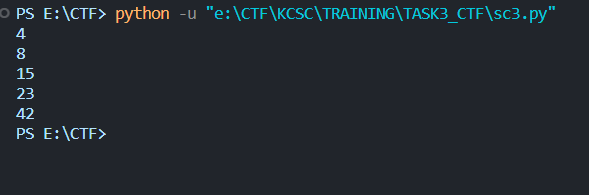
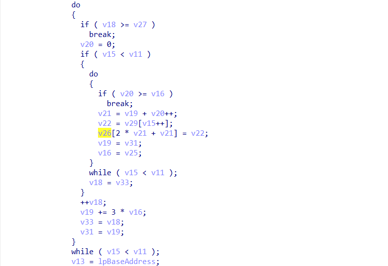
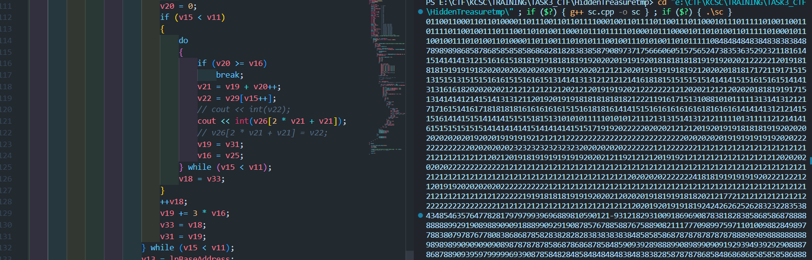
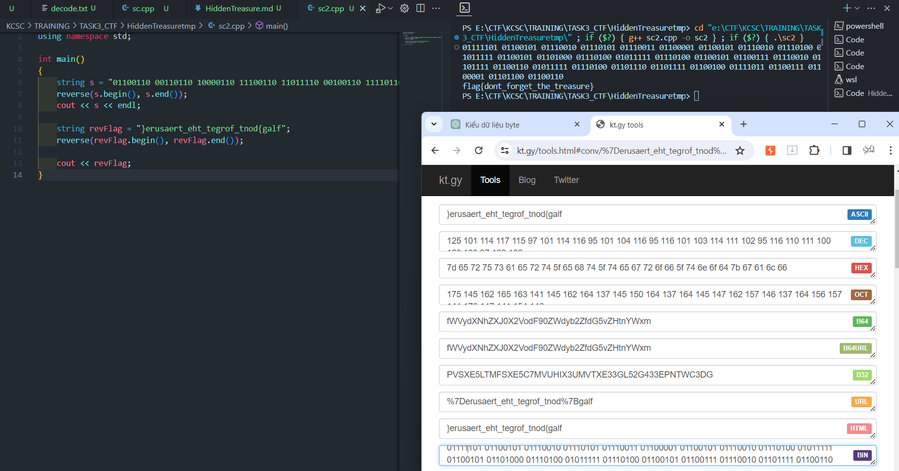

## Task3/RE

## EzSudoku

### Lời giải

- Nhận định về bài này, mình chưa đánh giá được độ khó một cách khách quan. Có thể do mindset chuẩn nên solve khá nhanh.

- Ban đầu mình đánh giá bài này trông khá ngợp vì chương trình được xây dựng bởi rất nhiều hàm :D
  
- Dù không hiểu hết toàn bộ chương trình. Khi mới tiếp xúc với chall này, mình có một số đặc điểm của chall mình rút ra được để xây dựng hướng đi.

  1. Chương trình không có `input` lẫn `argc/argv`. Khi chạy file thực thi, thứ bên dưới là output cố định của nó.
     
  2. Tên đề bài và mục `This is your challenge` cho ta một ma trận `9x9` với một vài ô điền sẵn. Có vể giả thiết gợi ý theo hướng giải ma trận sudoku. Vì ma trận in ra là cố định, mình có suy đoán rằng ma trận được in ra chính là key để mã hóa thành `flag`.

- Với 2 nhận định trên. Mình đã giải ma trận sudoku đó và thực hiện việc thay đổi giá trị khi debug để lấy được `flag`.
  
- Ma trận được in ra sau khi hàm `sub_B91D60()` chạy. Với tham số duy nhất là `v27` Có thể đó là mảng giá trị của ma trận.
  
- Có vẻ chính xác, thực hiện thay đổi các giá trị xem.
  
- Với các giá trị cho sẵn, ma trận sudoku 9x9 có một lời giải duy nhất như sau
  
- Input hàm sub_B91D60() có kiểu dữ liệu DWORD, nên ta sẽ sửa 4 byte một.
  
- Chạy chương trình sau khi sửa dữ liệu ma trận, thu được flag.
  

```
flag: 3a$iest_g4m3_0f_mY_l1f3
```

## F81E37E841D0B2C1D5738A7D60FD98BE

### Lời giải

- Bài này khá dễ nên mình sẽ không trình bày quá chi tiết :D.

- Load vào `IDA`, ta thấy chương trình khá đơn giản. chương trình gồm các hàm nhập xuất được viết thủ công tương ứng là sub_401050(), sub_401020().

  

- Chương trình yêu cầu ta nhập in `input` gồm 5 `key`. Nếu có gì cần chú ý ở đây thì đó là đặc tả dữ liệu `%hhd`. Theo khái niệm bên dưới, ta có thể dựa vào nó để vét cạn với độ lớn là 128<sup>5</sup> nếu cần thiết.

  

- Về đoạn mã hóa. Mình thấy có một dòng khá khó hiểu bên dưới nên phân tích một chút. Cá nhân mình cũng không rõ đoạn `(j + 1) - 5*(j + 1)/5` cho lắm nhưng trong quá trình debug có đọc liên tục giá trị từ đó ra nên kết luận được rằng nó tương đương với `(j + 1)%5`.

```C
    v5 = &v8 + j;
    v6 = j;
    v5[1] ^= v12[v6 - 5 * ((unsigned int)&v5[1 - (_DWORD)&v8] / 5) +1];

->  v5[1] = v8[j+1] ^ v12[j - 5*(&v8 + j + 1 - &v8)/5 + 1];
->  v5[1] = v8[j+1] ^ v12[j - 5*((j + 1)/5) + 1];
->  v5[1] = v8[j+1] ^ v12[(j + 1) - 5*((j + 1)/5)];
->  v5[1] = v8[j+1] ^ v12[(j + 1)%5];
```

- Từ đó ta có chương trình khai thác bằng phương pháp vét cạn như sau.

```python
v8 = "bdnpQai|nufimnug`n{FafhrW  "
flag = ""
for a in range(128):
    for b in range(128):
        for c in range(128):
            for d in range(128):
                for e in range(128):
                    for i in range(24):
                        if i % 2 != 0:
                            continue
                        v5 = [v8[i], v8[i+1]]
                        key = [a, b, c, d, e]
                        v5[0] = chr(ord(v8[i]) ^ key[i % 5])
                        v5[1] = chr(ord(v8[i+1]) ^ key[(i+1) % 5])

                        if v5[0] != 'f':
                            break
                        flag += v5[0]
                        flag += v5[1]
                    print(flag+'\n')
```

- Rút cục là `xor` từng đơn vị không khác gì nhau nhưng chương trình cố ý trình bày như vậy để gây rối :v. Như đã nói ở trên, thời gian để vét cạn là cực lớn mất khá nhiều thời gian. Đồng thời đề bài cho ta biết format flag là `flag{************}`. Vừa đủ 5 kí tự đầu để suy ngược ra key!

```python
print(ord('f') ^ ord(v8[0]))
print(ord('l') ^ ord(v8[1]))
print(ord('a') ^ ord(v8[2]))
print(ord('g') ^ ord(v8[3]))
print(ord('{') ^ ord(v8[4]))
```

- Chạy đoạn script trên, ta thu được `key`

  

- Hoàn thiện script với `key` vừa thu được.

```python
v8 = "bdnpQai|nufimnug`n{FafhrW  "
flag = ""
for i in range(25):
    if i % 2 != 0:
        continue
    v5 = [v8[i], v8[i+1]]
    key = [4, 8, 15, 23, 42]
    v5[0] = chr(ord(v8[i]) ^ key[i % 5])
    v5[1] = chr(ord(v8[i+1]) ^ key[(i+1) % 5])
    flag += v5[0]
    flag += v5[1]
print(flag)
```

```
flag: flag{easy_baby_challenge}
```

## HiddenTreasure

- Mình giải được bài HiddenTreasure này là nhờ một vài gợi ý từ WU https://hackmd.io/@S0L/REVnMISC_for_FPT#Writeup-RE--MISC.

### Lời giải

- Ở Chall này mình thu được kha khá kiến thức về việc thay đổi mã giả thành chương trình `C++` có thể thực thi. Tất nhiên mình có một vài khó khăn khi xử lí Chall này như sau:

1. Không rõ nội dung `input`, Dù thấy được chương trình sử dụng `argv[1]`, `argv[2]`. Mình chỉ có thể suy đoán được file ảnh `.bmp` được cấp sẽ là `argv[1]` bởi hàm `CreateFileW` có truyền đối số đọc file có sẵn. Chỉ khi được gợi ý mới rõ `argv[2]` là nội dung của file ảnh.

   

2. Xử lý chương trình từ mã giả để có thể thực thi đúng ý muốn. Tất nhiên đây không phải vấn đề lớn, mình chỉ việc định nghĩa lại các kiểu dữ liệu là được :v.

- Đi vào xử lý bài toán. Ta đã có hướng đi là phục chế lại chương trình cho sẵn, nhưng cần tìm hiểu để dữ liệu mình cần là gì để in ra. Mình xem xét đoạn thao tác với file và khẳng định được file sẽ thay đổi khi biến `lpBaseAddress` và giá trị trong các con trỏ trỏ tới nó thay đổi vì biến `lpBaseAddress` là ptr ánh xạ tới data trong file được mở ra trước đó thông qua hàm `MapViewOfFile()`.

  

```
    FileW = CreateFileW((LPCWSTR)argv[1], 0xC0000000, 1u, 0, 3u, 0x80u, 0);
    v5 = FileW
    v5 là tham số truyền vào hàm CreateFileMappingW() = FileMappingW
    FileMappingW là tham số truyền vào hàm MapViewOfFile() = lpBaseAddress
```

- Từ đó ta tìm tới các biến được gán với `lpBaseAddress`. Ta có v13, v14, v16 = v25, v27, v17 = v26. Tuy nhiên v13, v14, v16 v25, v27, được gán bởi giá trị cụ thể trong mảng `lpBaseAddress` nên không thể thay đổi data của file. chỉ v26 ~ v17 cùng trỏ tới `lpBaseAddress[v14]` mới có khả năng truy cập tới dữ liệu của file và thay đổi.

  

- Xác định được rằng v26 và v17 là đối tượng cần theo dõi, khéo xuống dưới ta chỉ thấy một dòng lệnh duy nhất là phép gán `v26[2 * v21 + v21] = v22;` nhằm thay đổi giá trị trong file.

  

- với v21 = const vì phụ thuộc vào v16 = const, cũng là biến duy nhất thay ảnh hưởng tới v16. Ta thử xem xét v22, v22 = v29 = v9. Ta thấy một đoạn biến đổi giá trị của v9[8*256]. Đoạn này mình bắt đầu thấy ngờ ngợ :v, mảng cấp phát bởi `malloc()` được sinh ngẫu nhiên thì biến đổi được gì nhỉ :D.

  

- Mình đặt vòng lặp in ra mảng v9 ở chương trình được phục chế sau đoạn biến đổi để xem giá trị của v9 có thông tin gì không. Lúc này có vẻ mục đích của Chall đã được làm rõ, mảng v9 sau khi biến đổi hoàn toàn mang giá trị `0`. Mình chợt nhớ tới tên đề bài: HiddenTreasure. Có lẽ phép gán các vị trí `v26[2 * v21 + v21] = v22 = v9[i];` là để che đi các giá trị mình cần đúng như tên đề bài :v. (Cơ mà cấp phát mảng `0` sao không dùng `calloc()` cho nhanh mà phải `xor` với `and` @@).

  

- Với ý tưởng đó, ta sẽ không gán cho v22-thứ dùng để giấu đi flag mà trực tiếp in ra `v26[2 * v21 + v21]`. Phần đầu của output là một chuỗi nhị phân khả năng cao là key. Nhặt ra và convert sang ASCII.

  

- Đoạn này convert ra data rác :v tìm hiểu một hồi thì biết giá trị dạng `bin` thường được lưu trữ ngược lại :c. `reverse()` string và convert rồi `reverse()` phát nữa là được.

  

```
flag: flag{dont_forget_the_treasure}
```

- convert Source

```C++
#include <bits/stdc++.h>
#include <windows.h>
typedef int _DWORD;
using namespace std;
char lpBaseAddress[1000000];
char argv2[100000];
void solve()
{
    cin >> argv2;
    unsigned int v3;     // kr00_4
    HANDLE FileW;        // eax
    void *v5;            // ebx
    HANDLE FileMappingW; // eax
    void *v8;            // esi
    byte *v9;            // ebx
    unsigned int v10;    // eax
    unsigned int v11;    // esi
    char v12;            // cl
    const void *v13;     // edi
    DWORD v14;           // edx
    unsigned int v15;    // ebx
    int v16;             // ecx
    char *v17;           // eax
    int v18;             // edx
    int v19;             // eax
    int v20;             // edi
    int v21;             // edx
    char v22;            // al
    HANDLE v23;          // [esp+4h] [ebp-128h]
    HANDLE hObject;      // [esp+8h] [ebp-124h]
    int v25;             // [esp+Ch] [ebp-120h]
    char *v26;           // [esp+10h] [ebp-11Ch]
    int v27;             // [esp+14h] [ebp-118h]
    char *lpBaseAddress; // [esp+18h] [ebp-114h]
    byte *v29;           // [esp+1Ch] [ebp-110h]
    DWORD FileSize;      // [esp+20h] [ebp-10Ch]
    int v31;             // [esp+20h] [ebp-10Ch]
    unsigned int v32;    // [esp+24h] [ebp-108h]
    int v33;             // [esp+24h] [ebp-108h]
    char Dest[256];      // [esp+28h] [ebp-104h] BYREF
    LPCSTR fileName = "inside-the-mind-of-a-hacker-memory.bmp";
    // if (argc == 3)
    {
        memset(Dest, 0, sizeof(Dest));
        wcstombs(Dest, (const wchar_t *)argv2, 0x100u);
        v3 = 256;
        if (v3)
        {
            FileW = CreateFileW(L"inside-the-mind-of-a-hacker-memory.bmp", 0xC0000000, 1u, 0, 3u, 0x80u, 0);
            v5 = FileW;
            v23 = FileW;
            if (FileW != (HANDLE)-1)
            {
                FileSize = GetFileSize(FileW, 0);
                if (FileSize == -1 || (FileMappingW = CreateFileMappingW(v5, 0, 4u, 0, 0, 0), v8 = FileMappingW, (hObject = FileMappingW) == 0))
                {
                    CloseHandle(v5);
                    return;
                }
                lpBaseAddress = (char *)MapViewOfFile(FileMappingW, 6u, 0, 0, 0);
                if (lpBaseAddress)
                {
                    v9 = (byte *)malloc(8 * v3);
                    v10 = 0;
                    v29 = v9;
                    v11 = 0;
                    v32 = 0;
                    do
                    {
                        v12 = Dest[v10];
                        v9[v11] = v12 & 1;
                        v9[v11 + 1] = (v12 >> 1) & 1;
                        v9[v11 + 2] = (v12 >> 2) & 1;
                        v9[v11 + 3] = (v12 >> 3) & 1;
                        v9[v11 + 4] = (v12 >> 4) & 1;
                        v9[v11 + 5] = (v12 >> 5) & 1;
                        v9[v11 + 6] = (v12 >> 6) & 1;
                        v10 = v32 + 1;
                        v9[v11 + 7] = (v12 >> 7) & 1;
                        v11 += 8;
                        v32 = v10;
                    } while (v10 < v3);

                    // for (int i = 0; i < 8 * v3; ++i)
                    //     cout << (int)v9[i];
                    // return;

                    v13 = lpBaseAddress;
                    // if (*(_DWORD *)lpBaseAddress == 19778 && FileSize >= *(_DWORD *)(lpBaseAddress + 2))
                    {
                        v14 = *(int *)(lpBaseAddress + 10);
                        if (v14 < FileSize && v11 < *(_DWORD *)(lpBaseAddress + 34))
                        {
                            v15 = 0;
                            v16 = *(_DWORD *)(lpBaseAddress + 18);
                            v27 = *(_DWORD *)(lpBaseAddress + 22);
                            v17 = &lpBaseAddress[v14];
                            v18 = 0;
                            v25 = v16;
                            v26 = v17;
                            *((int16_t *)lpBaseAddress + 3) = v11;
                            v33 = 0;
                            if (v11)
                            {
                                v19 = 0;
                                v31 = 0;
                                do
                                {
                                    if (v18 >= v27)
                                        break;
                                    v20 = 0;
                                    if (v15 < v11)
                                    {
                                        do
                                        {
                                            if (v20 >= v16)
                                                break;
                                            v21 = v19 + v20++;
                                            v22 = v29[v15++];
                                            // cout << int(v22);
                                            if (int(v26[2 * v21 + v21]) == 0 || int(v26[2 * v21 + v21]) == 1)
                                                cout << int(v26[2 * v21 + v21]);
                                            // v26[2 * v21 + v21] = v22;
                                            v19 = v31;
                                            v16 = v25;
                                        } while (v15 < v11);
                                        v18 = v33;
                                    }
                                    ++v18;
                                    v19 += 3 * v16;
                                    v33 = v18;
                                    v31 = v19;
                                } while (v15 < v11);
                                v13 = lpBaseAddress;
                            }
                            v9 = v29;
                        }
                    }
                    free(v9);
                    UnmapViewOfFile(v13);
                    CloseHandle(hObject);
                    CloseHandle(v23);
                }
                else
                {
                    CloseHandle(v8);
                    CloseHandle(v5);
                }
            }
        }
    }
}
int main()
{

    freopen("inside-the-mind-of-a-hacker-memory.bmp", "rb", stdin);
    freopen("output.txt", "w", stdout);
    solve();

    return 0;
}
```

- Code convert bin to flag

```C++
#include <bits/stdc++.h>
using namespace std;

int main()
{
    string s = "01100110 00110110 10000110 11100110 11011110 00100110 11110110 01110110 00101110 11111010 01100110 11110110 01001110 11100110 10100110 00101110 11111010 00101110 00010110 10100110 11111010 00101110 01001110 10100110 10000110 11001110 10101110 01001110 10100110 10111110";
    reverse(s.begin(), s.end());
    cout << s << endl;

    string revFlag = "}erusaert_eht_tegrof_tnod{galf";
    reverse(revFlag.begin(), revFlag.end());

    cout << revFlag;
}
```

## Mong WRITEUP này giúp ích cho các bạn!

```
from KMA
Author: 13r_ə_Rɪst
Email: sonvha2k23@cvp.vn
```
