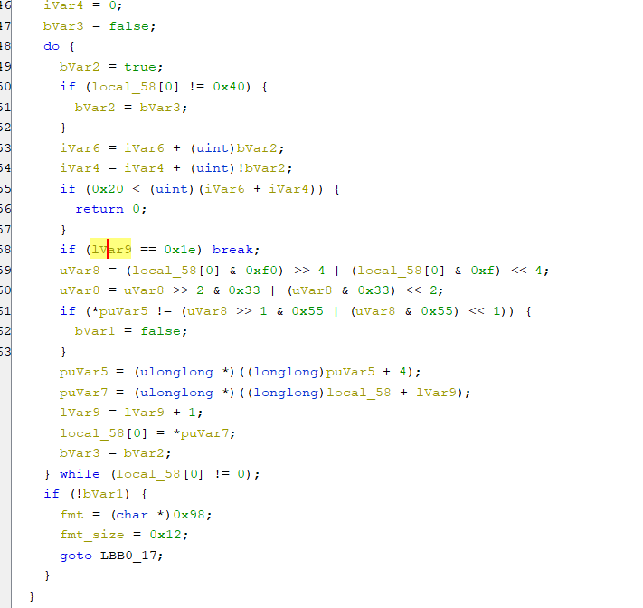
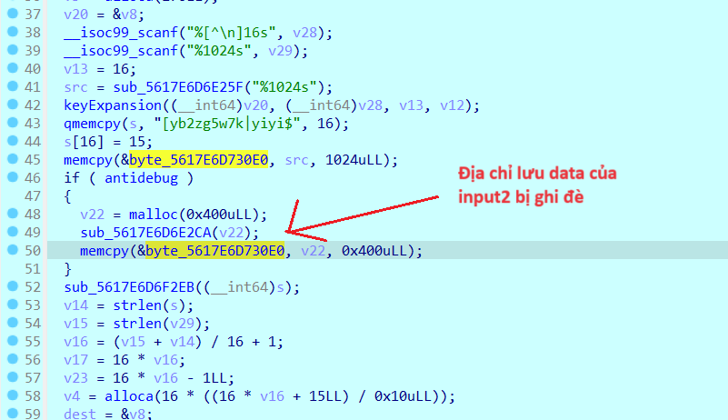

## Task4/ANTI-Debug/EX

### beehive

- Sử dụng `ghira` đển gen ra mã giả.



- Ta thấy chỉ có 1 cipher duy nhất là `puVar5`, chương trình thực hiện kiểm tra từng kí tự một với `puVar5` sau khi `encrypt`.

- Dưới đây là script vét cạn.

```python
flag_comp = 'abcdefghijklmnopqrstuvwxyzABCDEFGHIJKLMNOPQRSTUVWXYZ0123456789!@#$%^&*()_+-=<>,.?/{}[]\|~'
key = [0x56, 0xae, 0xce, 0xec, 0xFA, 0x2C, 0x76, 0xF6, 0x2E, 0x16, 0xCC, 0x4E, 0xFA, 0xAE, 0xCE, 0xCC,
       0x4E, 0x76, 0x2C, 0xB6, 0xA6, 0x02, 0x46, 0x96, 0x0C, 0xCE, 0x74, 0x96, 0x76]
flag = ""

for puVar5 in key:
    for ch in flag_comp:
        local_58 = ord(ch)
        uVar8 = (local_58 & 0xf0) >> 4 | (local_58 & 0xf) << 4
        uVar8 = (uVar8 >> 2) & 0x33 | (uVar8 & 0x33) << 2

        if puVar5 == (uVar8 >> 1 & 0x55 | (uVar8 & 0x55) << 1):
            flag += ch
            break
print("bi0sctf{"+flag+"}")
```

```
    flag: bi0sctf{jus7_4noth3r_us3rn4me@bi0s.in}
```

### baeBPF

- Chall này tại thời điểm viết WU đã đóng sever nên mình không có cơ hội hoàn thiện đầy đủ WU. Mình sẽ nêu ra các bước thực hiện và trình bày dựa trên những gì còn sót lại trong máy^^.

- Bài này gồm 2 phần ở phần đầu, ta phân tích đoạn mã máy được cấp để lấy tên file và password.

- Ở phần 2,

```python
#include <stdio.h>
#include <stdint.h>

void decrypt (uint32_t v[2], const uint32_t k[4]) {
    uint32_t v0=v[0], v1=v[1], sum=0xC6EF3720, i;  /* set up; sum is (delta << 5) & 0xFFFFFFFF */
    uint32_t delta=0x9E3779B9;                     /* a key schedule constant */
    uint32_t k0=k[0], k1=k[1], k2=k[2], k3=k[3];   /* cache key */
    for (IMG/bi0s/i=0; i<32; i++) {                         /* basic cycle start */
        v1 -= ((v0<<4) + k2) ^ (v0 + sum) ^ ((v0>>5) + k3);
        v0 -= ((v1<<4) + k0) ^ (v1 + sum) ^ ((v1>>5) + k1);
        sum -= delta;
    }                                              /* end cycle */
    v[0]=v0; v[1]=v1;
}

int main() {
    long long int vals[] = {0x33ae2685,0x230bcdd5,0x4f5ac093,0x3dc3e00a,0xda19d0a1,0x32c52ad0,0xc904ffac,0x3037b842,0x9c7bf31e,0x4b8dfebc,0x33335ba7,0x4c4c9188,0xa555d9a9,0xaa069852,0xa177367f,0x79daa10f,0x29ca035c,0x319fbbc8,0xd51b4a1c,0x4a1b63b6,0x99f5d2f1,0xf35fdd82,0x7e70314f,0x42077d00,0x4f84cb2b,0x4a73846a,0xbbb0581e,0x8c33c34f,0x4eb73143,0xac45de0,0x82592087,0xc02544fa,0x56590be4,0xd2f78e08,0xb2c9d125,0x65e106d8,0x46711844,0xcf16ec7f,0xc85dde46,0x51d873d,0x50319f0f,0x8e5370bd,0x80145a76,0xbdbe90a6,0x3a10947e,0xfaf968c7,0xac700a03,0x47e061be,0xe9e65b90,0xe3c65a80,0xd707d969,0x40e93f77,0x447cf10e,0xbc69c7df,0xd8c669de,0x36c05ccf,0x876411ba,0xb37a6436,0xcdbeac33,0x7ba23db9,0xc18251bd,0x926d7a16,0x9ffb0134,0xc7f9ab96,0xc635711e,0x45b69a8,0x7b0fdd2e,0xf54849a7,0x61e5d839,0x1f12687d,0xb39a4ba1,0xd4fa2f5a,0xc308a7fd,0xcc0f199b,0x6b35768,0xecb39e48,0xb2c9d125,0x65e106d8,0x9e9a0f73,0xc58bdf39,0xa9bb76d1,0xc75ccd7,0x8473c66,0x8a4ed0e5,0xae1dcf9a,0x214f0ed5,0xfb6bf695,0x56e45cc6,0x47e4e2b9,0x8e2107d1,0x5a24b1dc,0x70599ee2,0x6cd313ec,0x4fa221e8,0x6696e856,0x62fde305,0x79958e01,0x1b99f294,0x876fd3a,0x59c1d749,0x0,0x0};
    for(IMG/bi0s/int i = 0; i < sizeof(vals)/sizeof(vals[0]); i+=2) {
        uint32_t v[2] = {vals[i], vals[i+1]};
        uint32_t k[4] = {0x12341234, 0x12341234, 0x12341234, 0x12341234};
        decrypt(v, k);

        printf("%llx", v[0]);
        printf("%llx", v[1]);
    }
    return 0;
}
```

- Output của phần 2 dùng để encrypt ra chall cuối cùng là 1 file python

```python
def reccur(IMG/bi0s/i):
    if(not i):
        return 1
    if(IMG/bi0s/i == 1):
        return  3
    val_2 = 2 *reccur(IMG/bi0s/i-1)
    return val_2 + 3* reccur(IMG/bi0s/i-2)
    exit()
enc_flag = [102,75,163,239,156,158,7,143,92,120,0,54,183,65,199,253,60,182,204]
for i in range(20):
   flag_val = enc_flag[i]
   ctr_val = reccur((IMG/bi0s/i * i)+1)% 256
   val = flag_val ^ ctr_val
   print( )
   print(chr(val),end="")
```

- Chương trình chạy rất lâu vì gọi đệ quy, nhiệm vụ của ta ở đây là `dp` khử đệ quy. Khá dễ vì nó cũng tương tự bài toán fibonacci cơ bản.

```python
def reccur(IMG/bi0s/i):
    dp = [1, 3]
    for j in range(2, i+1):
        val = 2*dp[j-1] + 3 * dp[j-2]
        dp.append(val)
    return dp[i]

enc_flag = [102, 75, 163, 239, 156, 158, 7, 143,
            92, 120, 0, 54, 183, 65, 199, 253, 60, 182, 204]
flag = ""
for i in range(19):
    flag_val = enc_flag[i]
    ctr_val = reccur((IMG/bi0s/i * i)+1) % 256
    flag += chr(flag_val ^ ctr_val)

print('bi0sctf{'+flag+'}')
```

```
flag: bi0sctf{eBPF_wtF_1s_th4t???}
```

### t0y-b0x

- Bài này có lẽ quá sức với mình, không thể phân tích được khi chưa nắm rõ `AES`. Vậy nên ở phần này mình sẽ trình bày một thứ sát với kiến thức mình hơn đó là vấn đề antidebug trong bài.

- Trong chall này xuất hiện antidebug, có vể nó được thực thi trong một hàm tiền xử lý nên khi cần gọi ra là được. Công đoạn check debugger trả về `true`, chương trình sẽ nhảy vào thực thi 3 dòng lệnh trong đó và sinh ra biến `v22` rồi ghi đè lên địa chỉ `byte_5617E6D730E0`- đã được truyền vào input2 trước đó.

  

  

- Xem xét hàm thay đổi giá trị của biến `antidebug`, tại dòng `int 0x80` chương trình chạy đến như hình dưới, mặc dù đoạn biến đổi bên trên hơi phức tạp nhưng đều là lấy ra giá trị `const` nên ta không cần quan tâm. Mình nhận thấy các giá trị được truyền vào 4 thanh ghi đa dụng, và giá trị trả về nằm trong `eax` sau khi gọi `syscall` sẽ được truyền vào biến `antidebug`. Đó là những điều không xuất hiện trong mã giả mà chỉ quan sát được qua các dòng lệnh~~.

  

- Đó là quá trình thực hiện detect debugger, nhưng nó hoạt động ra sao? Ta cũng quen thuộc với việc truyền chỉ lệnh vào 4 thanh ghi eax, ebx, ecx, edx và gọi `syscall` để thực hiện lệnh đọc, in...Trường hợp này cũng tương tự vậy.

  

- Với đối số nằm trong `eax` là `0x1a = 26`, tương ứng là `sys_ptrace`, dùng để kiểm tra chương trình có đang được chạy thông qua debugger hay không, nếu có nó sẽ trả về giá trị khác 0.

  

- Trong chall này, sau khi gọi sys_ptrace(), `eax` lập tức trả về `-1`

  

- Để bypass, hoặc ta sửa ngay giá trị `eax` tại đây, hoặc ta sửa cờ `zf` trong main để bỏ qua các dòng lệnh ghi đè mảng lưu input2 như đã nhắc ở trên. Đó là những điều mình nắm được ở chall này. Phần còn lại đã được anh Sơn hướng dẫn trong thread của chall^^.

## Mong WRITEUP này giúp ích cho các bạn!

```

from KMA
Author: 13r_ə_Rɪst
Email: sonvha2k23@cvp.vn

```
