## Task4/ANTI-Debug

### Giới thiệu

- Anti-Debug là các kỹ thuật được sử dụng để vô hiệu hóa các Debugger, nhằm mục đích gây khó khăn cho công việc Reverse, làm tiêu tốn nhiều thời gian hơn khi thực hiện phân tích một mẫu.

- Một số phương pháp Anti-Debug có thể kể tới:

  1. Nhận diện Debugger

  Một kỹ thuật Anti-Debug khác đó là sử dụng các biện pháp mà hệ điều hành kiểm soát quá trình debug. Bao gồm việc sử dụng các API cung cấp thông tin về một chương trình có bị debug hay không, kiểm tra các breakpoint được đặt trong đoạn code thực thi, loại bỏ các hardware breakpoint và sử dụng các lỗi đã biết của debugger để gây crash.

  2. Làm rối luồng chương trình

  Một biện pháp đơn giản nhất được sử dụng để Anti-Debug đó là làm rối code. Cách này được sử dụng để chống lại cả các Debugger và các Disassembler.

  Có thể thay đổi tên các hàm, các biến thành những cái tên tối nghĩa hoặc tên được sinh ra ngẫu nhiên. Sử dụng nhiều lệnh jump tạo thành những vòng luẩn quẩn. Mã hóa các chuỗi được sử dụng.

  Tất cả những biện pháp trên khiến công việc đọc đoạn code sau khi disassembly trở nên khó khăn hơn rất nhiều.

  3. Mã hóa code

  Biện pháp biển đổi code ở mức độ cao hơn đó là mã hóa code và sau đó giải mã rồi thực thi trong quá trình chạy chương trình. Ta chỉ có thể đọc được đoạn code thực sự thực thi công việc cụ thể khi sử dụng các debugger và đọc trong quá trình chương trình thực thi.

  Kỹ thuật này thường được sử dụng bởi virus và malware.

#### Debug Flags

1. IsDebuggerPresent()

- IsDebuggerPresent() là một WIN API cơ bản dùng để kiểm tra chương trình có bị debug hay không.

```C++
#include <bits/stdc++.h>
#include <windows.h>
using namespace std;

void debuggerDetected()
{
    cout << "Debugger detected";
}

void normalProcess()
{
    cout << "successfully access";
}

int main()
{
    if (IsDebuggerPresent())
        debuggerDetected();
    else
        normalProcess();
    return 0;
}
```

- `IsDebuggerPresent()` là một WIN API cơ bản dùng để kiểm tra chương trình có chạy thông qua các `debugger` hay không. Nếu chương trình bị `debug`, thanh ghi `eax` đóng vai trò là flag kiểm tra `true/false` để thực thi chương trình sau đó theo mục đích.

  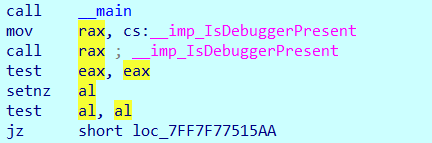

- Ảnh dưới cho thấy chương trình thực thi bằng các cách khác nhau sẽ cho đầu ra khác nhau, phân biệt là luồng chương trình chuẩn và luồng chương trình bị định hướng khác khi không `bypass` hàm `IsDebuggerPresent()`.

  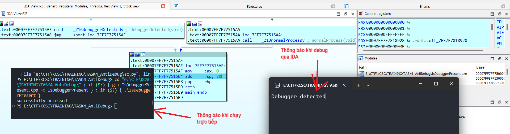

- Để `bypass`, ta chỉ cần sửa flag về `0`.

  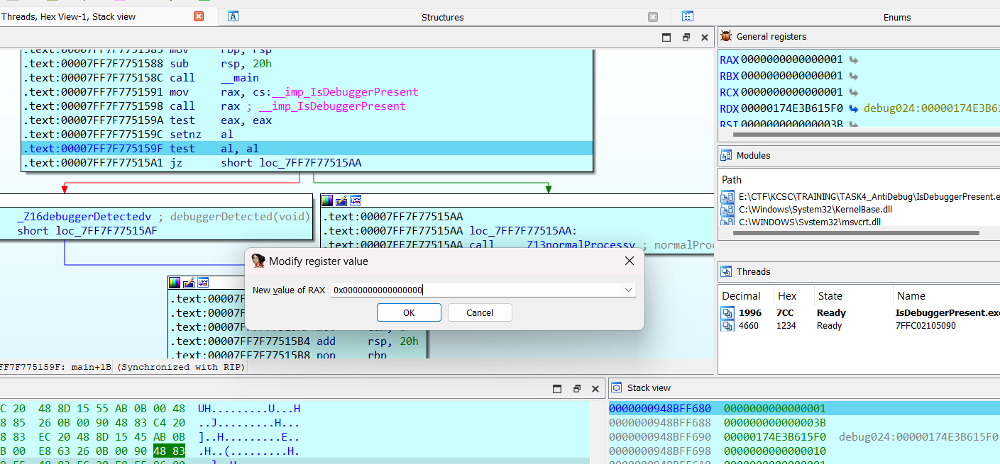

- Chương trình debug bằng `IDA` đã `bypass` hàm kiểm tra.

  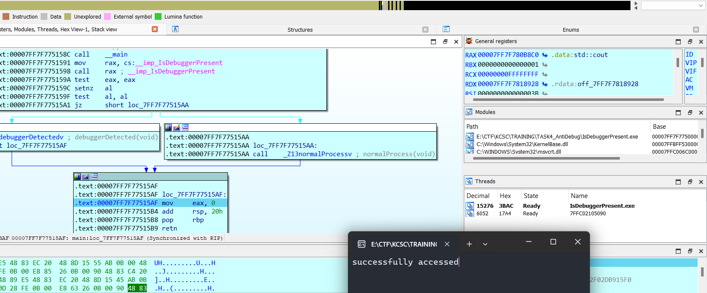

2. RemoteDebuggerPresent()

- Thực hiện kiểm tra xem một chương trình có được gỡ lỗi từ xa hay không. `Remote` không nhất thiết là `debug` ở máy khác mà có thể `detect` xem liệu chương trình có được `debug` song song quá trình thực thi hay không. Sử dụng chế độ `Local window debugger` của `IDA`, ta thấy rằng hàm `CheckRemoteDebuggerPresent()` vẫn trả về `true`.

  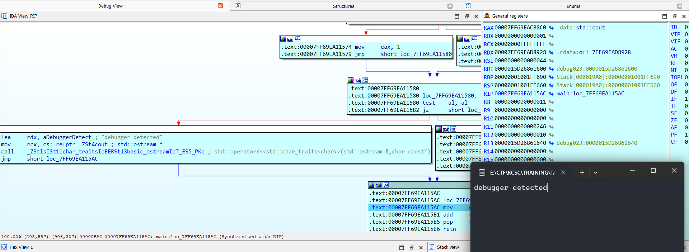

3. NtQueryInformationProcess()

- `ProcessDebugFlags ~ 0x1f` và `ProcessDebugObjectHandle ~ 0x1e` là hai đối số `ProcessInformation` của `NTAPI` Nhằm kiểm tra `EPROCESS` và `debug object` tương ứng.
- Chương trình thực hiện công đoạn detect debugger của  và  thực hiện kiểm tra `outout` tương ứng của hai chương trình.

### Một chút demo sử dụng kĩ thuật anti-debug nhằm gây rối luồng chương trình.

Trong một vài tình huống cụ thể. Việc sử dụng các hàm kiểm tra trên và thay đổi thông tin chương trình sai biệt khi `debug` so với chạy thông thường. Mình tự xây dựng một đoạn chương trình sử dụng hàm `IsDebuggerPresent()` để định hướng debugger tới `_fakethread()` và nhận `output` như hình dưới. Dù  trông hơi nhà quê nhưng để demo cũng đủ rồi :v.

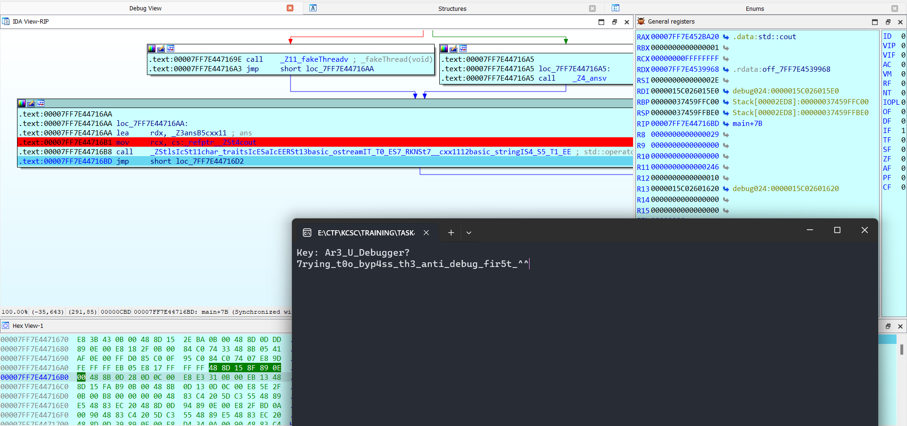

#### Object Handles

1. OpenProcess()

- Cá nhân mình không có cách kiểm tra độ tin cậy của hàm này. Ý tưởng được đưa ra là sử dụng `OpenProcess()` để phân biệt người thực thi bởi chỉ các thiết bị được cấp quuyền thực thi/debug mới khiến hàm trả về giá trị khác `NULL`. Vì thực thi source trên chính máy của bản thân nên mình luôn được cấp quyền, nên dù chạy ở đâu chương trình cũng trả về `false`. Tham khảo chương trình của mình 

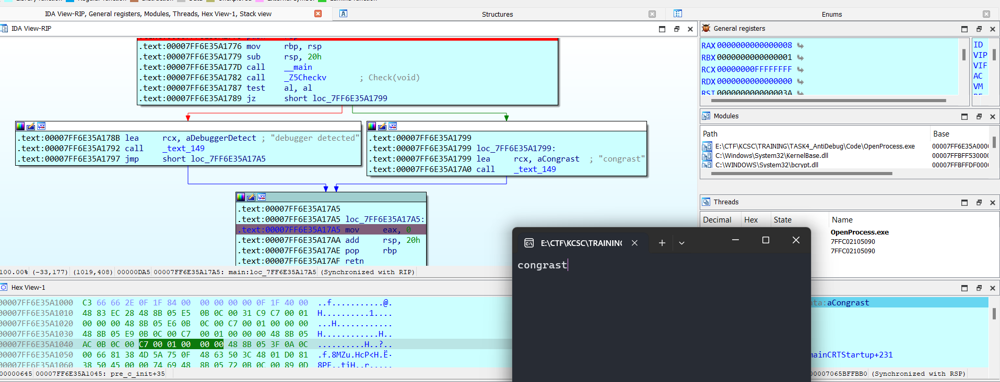

2. CreateFile()

- Mục đích sử dụng của `CreateFile()` cũng đánh vào quyền truy cập tương tự hàm OpenProcess(). Việc xử lý thủ công khiến thao tác đóng mở file khi vẫn đang thực thi chương trình hiện tại gặp vấn đề. Vấn đề tương tự việc sử dụng hàm trên, luôn thực thi được hàm sử dụng để antidebug dù dùng bất kể debugger nào khiến bước kiểm tra gặp vấn đề. ham khảo chương trình của mình

  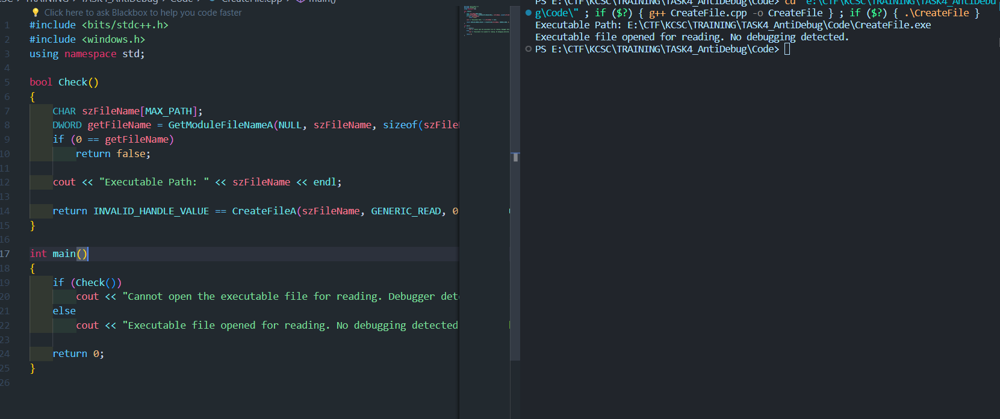

3. LoadLibrary()

- Mục đích sử dụng `LoadLibrary()` là để kiểm tra sự kiện `LOAD_DLL_DEBUG_EVENT` khi thực thi chương trình. Nếu việc thực thi chương trình được debug thay vì chạy tự động. Ta cần tự đóng HANDLE của hàm `LoadLibrary()` trước khi mở file thông qua hàm `CreateFileA()`. Dưới đây là hình minh họa của việc thực thi trực tiếp và thực thi trên ` IDA` đã trả về 2 kết quả khác nhau, chứng minh chức năng `anti-debug` hoạt động ổn định.

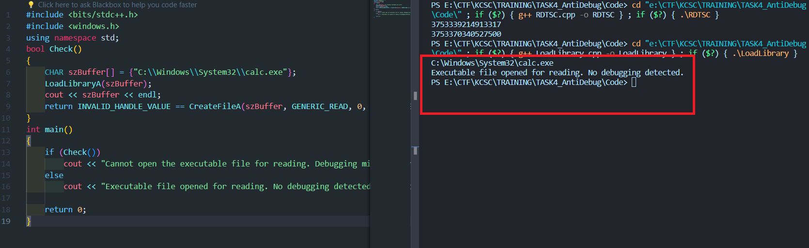

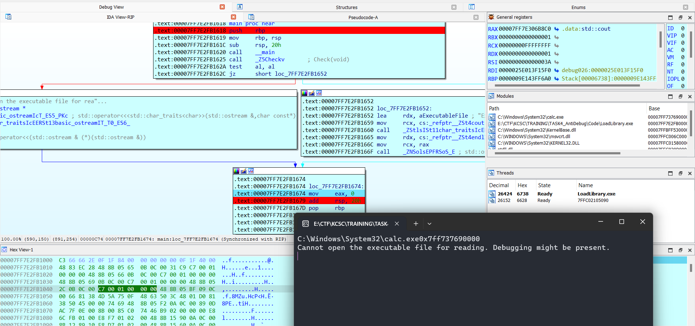

#### Exceptions

1. UnhandledExceptionFilter()

- Sử dụng hàm `UnhandledExceptionFilter()` nhằm xử lí các ngoại lệ không catch được(unhandled exceptions). Chương trình bên dưới detect debugger bằng cách xác định xem debugger có bắt lấy hay không. Nếu ngoại lệ được thực thi và bỏ qua các dòng lệnh dưới, biến `bDebugged` sẽ không được gán lại thành `false` và trả về `true`.

```C++
LONG UnhandledExceptionFilter(PEXCEPTION_POINTERS pExceptionInfo)
{
    PCONTEXT ctx = pExceptionInfo->ContextRecord;
    ctx->Eip += 3; // Skip \xCC\xEB\x??
    return EXCEPTION_CONTINUE_EXECUTION;
}

bool Check()
{
    bool bDebugged = true;
    SetUnhandledExceptionFilter((LPTOP_LEVEL_EXCEPTION_FILTER)UnhandledExceptionFilter);
    __asm
    {
        int 3                      // CC
        jmp near being_debugged    // EB ??
    }
    bDebugged = false;

being_debugged:
    return bDebugged;
}
```

2. RaiseException()

- Sử dụng `RaiseException()` nhẳm tái kiểm tra các `Exception` như là `DBC_CONTROL_C` hay `DBG_RIPEVENT` trong quá trình chạy. Ở chương trình dưới, việc check ra exception `DBG_CONTROL_C` có được sử dụng hay chưa để tái thực thi và trả giá trị hàm kiểm tra thành `true`.

```C++
bool Check()
{
    __try
    {
        RaiseException(DBG_CONTROL_C, 0, 0, NULL);
        return true;
    }
    __except(DBG_CONTROL_C == GetExceptionCode()
        ? EXCEPTION_EXECUTE_HANDLER
        : EXCEPTION_CONTINUE_SEARCH)
    {
        return false;
    }
}
```

#### Timing

1. RDPMC/RDTSC

- là hàm sử dụng để tính khoảng thời gian bắt đầu gọi hàm cho tới lần gọi hàm tiếp theo. Chương trình bên dưới mình đặt hàm `sleep()` nhằm mô phỏng việc step từng dòng lệnh khi `debug` để kiểm tra độ chênh lệch sau 2 lần gọi `__rdtsc()`. Với kết quả chênh lệch khá cao so với, ta hoàn toàn có thể đặt lệnh kiểm tra độ lớn = t2-t1 ở sau đó để anti-debug.

  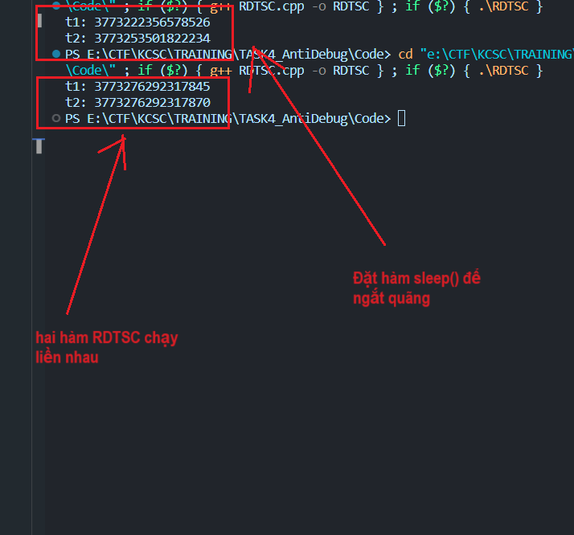

```C++
#include <bits/stdc++.h>
#include <windows.h>
#include <unistd.h>
using namespace std;
int main()
{
    long long t1, t2;
    t1 = __rdtsc();

    sleep(10);

    t2 = __rdtsc();
    cout << t1 << '\n'
         << t2;
}
```

2. GetLocalTime()/GetSystemTime()

- Mục đích cũng tương tự hai hàm trên. Khi ta coi khoảng thời gian thực thi chương trình giữa hai khoảng GetTime() là không đáng kể, ta hoàn toàn có thể detect ra debugger khi thấy sự chênh lệch giữa 2 mốc thời gian quá lớn so với kì vọng.

```C++
#include <bits/stdc++.h>
#include <windows.h>
using namespace std;

bool _GetLocalTime(DWORD64 qwNativeElapsed)
{
    SYSTEMTIME stStart, stEnd;
    FILETIME ftStart, ftEnd;
    ULARGE_INTEGER uiStart, uiEnd;

    GetLocalTime(&stStart);
    // solve()
    GetLocalTime(&stEnd);

    if (!SystemTimeToFileTime(&stStart, &ftStart))
        return false;
    if (!SystemTimeToFileTime(&stEnd, &ftEnd))
        return false;

    uiStart.LowPart = ftStart.dwLowDateTime;
    uiStart.HighPart = ftStart.dwHighDateTime;
    uiEnd.LowPart = ftEnd.dwLowDateTime;
    uiEnd.HighPart = ftEnd.dwHighDateTime;
    cout << uiEnd.QuadPart - uiStart.QuadPart << endl;
    return (uiEnd.QuadPart - uiStart.QuadPart) > qwNativeElapsed;
}

bool _GetSystemTime(DWORD64 qwNativeElapsed)
{
    SYSTEMTIME stStart, stEnd;
    FILETIME ftStart, ftEnd;
    ULARGE_INTEGER uiStart, uiEnd;

    GetSystemTime(&stStart);
    // solve()
    GetSystemTime(&stEnd);

    if (!SystemTimeToFileTime(&stStart, &ftStart))
        return false;
    if (!SystemTimeToFileTime(&stEnd, &ftEnd))
        return false;

    uiStart.LowPart = ftStart.dwLowDateTime;
    uiStart.HighPart = ftStart.dwHighDateTime;
    uiEnd.LowPart = ftEnd.dwLowDateTime;
    uiEnd.HighPart = ftEnd.dwHighDateTime;
    return (uiEnd.QuadPart - uiStart.QuadPart) > qwNativeElapsed;
}

int main()
{
    time_t present;
    cout << present << endl;
    if (_GetSystemTime(present))
        cout << "debugger detected" << endl;
    else
        cout << "congrast" << endl;
    return 0;
}
```

#### Process Memory

1. Software Breakpoints (INT3)

- Là phương pháp detect ra các `breakpoint` có trong chương trình. Với ý tưởng rằng các chương trình bị debug luôn xuất hiện `breakpoint` và ngược lại, ta có thể phân biệt được chương trình có bị `debug` hay không. INT3 là một opcode trong mã máy được sử dụng để sinh ra một interrupt 3 (INT 3). Điều này tương đương với việc chèn một `breakpoint` vào mã máy.

```C++
bool CheckForSpecificByte(BYTE cByte, PVOID pMemory, SIZE_T nMemorySize = 0)
{
    PBYTE pBytes = (PBYTE)pMemory;
    for (SIZE_T i = 0; ; i++)
    {
        // Break on RET (0xC3) if we don't know the function's size
        if (((nMemorySize > 0) && (i >= nMemorySize)) ||
            ((nMemorySize == 0) && (pBytes[i] == 0xC3)))
            break;

        if (pBytes[i] == cByte)
            return true;
    }
    return false;
}

bool IsDebugged()
{
    PVOID functionsToCheck[] = {
        &Function1,
        &Function2,
        &Function3,
    };
    for (auto funcAddr : functionsToCheck)
    {
        if (CheckForSpecificByte(0xCC, funcAddr))
            return true;
    }
    return false;
}
```

2. anti-step-over

- anti-step-over là kĩ thuật được sử dụng nhằm bắt buộc các debugger dừng chương trình tại các vị trí không mong muốn(các vị trí không set `breakpoints`).

3. CreateToolhelp32Snapshot()

- CreateToolhelp32Snapshot() được sử dụng để lấy thông tin về tất cả các process khác. Tương tự với cách detect ở trên. Ta sử dụng hàm `Toolhelp32ReadProcessMemory()` để kiểm tra xem khối lệnh hiện tại có được đặt `breakpoint`-dấu hiệu của debugger hay không(0xCC ~ INT3).

```C++
#include <TlHelp32.h>

bool foo()
{
    // ..

    PVOID pRetAddress = _ReturnAddress();
    BYTE uByte;
    if (Toolhelp32ReadProcessMemory(GetCurrentProcessId(), _ReturnAddress(), &uByte, sizeof(BYTE), NULL))
    {
        if (uByte == 0xCC)
            ExitProcess(0);
    }

    // ..
}
```

#### Assembly instructions

1. INT3

- Ý tưởng kiểm tra INT3 tương tự ở trên. Việc một chương trình được thực thi bình thường sẽ throw các `breakpoint` vào exception, cụ thể ở đây là `EXCEPTION_BREAKPOINT`. Ngược lại, với một chương trình chạy trong trangj thái debug sẽ bỏ qua exception này để debugger đặt `breakpoints` trên chương trình. Vậy khi gọi ra opcode `INT3` mà không xảy ra exception, điều đó chứng tỏ chương trình đang chạy trong trạng thái debug.

```C++
bool IsDebugged()
{
    __try
    {
        __asm int 3;
        return true;
    }
    __except(EXCEPTION_EXECUTE_HANDLER)
    {
        return false;
    }
}
```

2. INT 2D

- Mục đích tương tự `INT3`. Tuy nhiên khác ở cơ chế hoạt động.

```C++
bool IsDebugged()
{
    __try
    {
        __asm xor eax, eax;
        __asm int 0x2d;
        __asm nop;
        return true;
    }
    __except(EXCEPTION_EXECUTE_HANDLER)
    {
        return false;
    }
}
```

3. DeBugBreak

- Tương tự việc sử dụng trực tiếp `INT3`, hàm DebugBreak tạo ra một breakpoint trong chương trình. Giống như ở trên, việc xuất hiện breakpoint khi chương trình thực thi bình thường sẽ đi kèm `EXCEPTION_BREAKPOINT`, nếu nó không xuất hiện, có thể khẳng định rằng chương trình đang được chạy trên một `debugger`.

```C++
bool IsDebugged()
{
    __try
    {
        DebugBreak();
    }
    __except(EXCEPTION_BREAKPOINT)
    {
        return false;
    }

    return true;
}
```

#### Interactive Checks

1. BlockInput()

- BlockInput() được sử dụng để tạm thời chặn các thiết bị đầu vào như bàn phím và chuột. Ứng dụng của hàm này trong việc antidebug là detect các tool và chặn nếu tool có truyền input khi chương trình đang thực thi. Chương trình bên dưới thực hiện chặn 2 lần thiết bị đầu vào, sau 2 lần sẽ trả về `true` để các thiết bị hoạt động bình thường.

```C++
bool IsHooked ()
{
    BOOL bFirstResult = FALSE, bSecondResult = FALSE;
    __try
    {
        bFirstResult = BlockInput(TRUE);
        bSecondResult = BlockInput(TRUE);
    }
    __finally
    {
        BlockInput(FALSE);
    }
    return bFirstResult && bSecondResult;
}
```

2. Self-Debugging

- Vì không thể thực thi 1 chương trình song song trên 2 môi trường(như hình dưới), ta có thể detect debugger thông qua việc một chu trình bị deny khi chương trình dang thực thi. `DebugActiveProcess()` là hàm có thể hỗ trợ điều này, `DebugActiveProcess` cho phép ta kết nối một trình debug với một chương trình đang chạy.

```C++
#define EVENT_SELFDBG_EVENT_NAME L"SelfDebugging"

bool IsDebugged()
{
    WCHAR wszFilePath[MAX_PATH], wszCmdLine[MAX_PATH];
    STARTUPINFO si = { sizeof(si) };
    PROCESS_INFORMATION pi;
    HANDLE hDbgEvent;

    hDbgEvent = CreateEventW(NULL, FALSE, FALSE, EVENT_SELFDBG_EVENT_NAME);
    if (!hDbgEvent)
        return false;

    if (!GetModuleFileNameW(NULL, wszFilePath, _countof(wszFilePath)))
        return false;

    swprintf_s(wszCmdLine, L"%s %d", wszFilePath, GetCurrentProcessId());
    if (CreateProcessW(NULL, wszCmdLine, NULL, NULL, FALSE, 0, NULL, NULL, &si, &pi))
    {
        WaitForSingleObject(pi.hProcess, INFINITE);
        CloseHandle(pi.hProcess);
        CloseHandle(pi.hThread);

        return WAIT_OBJECT_0 == WaitForSingleObject(hDbgEvent, 0);
    }

    return false;
}

bool EnableDebugPrivilege()
{
    bool bResult = false;
    HANDLE hToken = NULL;
    DWORD ec = 0;

    do
    {
        if (!OpenProcessToken(GetCurrentProcess(), TOKEN_ADJUST_PRIVILEGES, &hToken))
            break;

        TOKEN_PRIVILEGES tp;
        tp.PrivilegeCount = 1;
        if (!LookupPrivilegeValue(NULL, SE_DEBUG_NAME, &tp.Privileges[0].Luid))
            break;

        tp.Privileges[0].Attributes = SE_PRIVILEGE_ENABLED;
        if( !AdjustTokenPrivileges( hToken, FALSE, &tp, sizeof(tp), NULL, NULL))
            break;

        bResult = true;
    }
    while (0);

    if (hToken)
        CloseHandle(hToken);

    return bResult;
}

int main(int argc, char **argv)
{
    if (argc < 2)
    {
        if (IsDebugged())
            ExitProcess(0);
    }
    else
    {
        DWORD dwParentPid = atoi(argv[1]);
        HANDLE hEvent = OpenEventW(EVENT_MODIFY_STATE, FALSE, EVENT_SELFDBG_EVENT_NAME);
        if (hEvent && EnableDebugPrivilege())
        {
            if (FALSE == DebugActiveProcess(dwParentPid))
                SetEvent(hEvent);
            else
                DebugActiveProcessStop(dwParentPid);
        }
        ExitProcess(0);
    }

    // ...

    return 0;
}
```

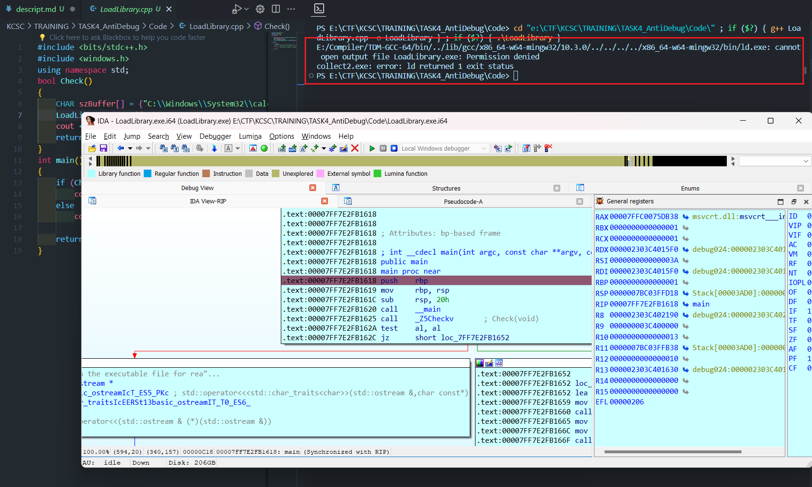

3. NtSetInformationThread()

- NtSetInformationThread() được dùng để ẩn đi một luồng chỉ định khỏi `debugger` thông qua hàm ThreadHideFromDebugger().

```C++
#define NtCurrentThread ((HANDLE)-2)

bool AntiDebug()
{
    NTSTATUS status = ntdll::NtSetInformationThread(
        NtCurrentThread,
        ntdll::THREAD_INFORMATION_CLASS::ThreadHideFromDebugger,
        NULL,
        0);
    return status >= 0;
}
```

#### MISC

1. FindWindows

- Đoạn chương trình dưới đây thực hiện detect debugger bằng cách so sánh tên của các cửa sổ hiện tại với những cái tên debugger Windows có sẵn trong `vWindowClasses`. Nếu có tác vụ cùng tên với chúng, chương trình sẽ trả về `true`.

```C++
#include <bits/stdc++.h>
#include <windows.h>
using namespace std;

const vector<string> vWindowClasses = {
    "The Interactive Disassembler",
    "gdb",
    "IDA",
    "antidbg",
    "ID",
    "ntdll.dll",
    "ObsidianGUI",
    "OLLYDBG",
    "Rock Debugger",
    "SunAwtFrame",
    "Qt5QWindowIcon"
    "WinDbgFrameClass", // WinDbg
    "Zeta Debugger",
};

bool IsDebugged()
{
    for (auto &sWndClass : vWindowClasses)
    {
        if (NULL != FindWindowA(sWndClass.c_str(), NULL))
            return true;
    }
    return false;
}

int main()
{
    if (IsDebugged())
        cout << "debugger detected" << endl;
    else
        cout << "congrast" << endl;
    return 0;
}
```

2. DbgPrint()

- exception `DBG_PRINTEXCEPTION_C` sẽ được xử lý chỉ khi chương trình được thực thi qua debugger. Với ý tưởng kiểm tra trạng thái của exception `DBG_PRINTEXCEPTION_C`, ta có thể phân biệt được chương trình có chạy thông qua debugger hay không.

```C++
bool IsDebugged()
{
    __try
    {
        RaiseException(DBG_PRINTEXCEPTION_C, 0, 0, 0);
    }
    __except(GetExceptionCode() == DBG_PRINTEXCEPTION_C)
    {
        return false;
    }

    return true;
}
```

3. DbgSetDebugFilterState()

- Đơn giản chỉ là kiểm tra trạng thái hàm `DbgSetDebugFilterState()` hay `NtSetDebugFilterState()`, hai hàm chỉ xuất hiện khi chương trình được thực thi thông qua debugger.

```C++
bool IsDebugged()
{
    return NT_SUCCESS(ntdll::NtSetDebugFilterState(0, 0, TRUE));
}
```

## Mong WRITEUP này giúp ích cho các bạn!

```

from KMA
Author: 13r_ə_Rɪst
Email: sonvha2k23@cvp.vn

```
