## Task4/ANTI-Debug/EX

### anti1

- Về bài đầu tiên, Chương trình thực hiện antidebug bằng cách `throw exception` khi detect ra chương trình đang được debug và hướng ta tới luồng chương trình sai. Tuy nhiên có vẻ `IDA` quá mạnh cho phép debugger thoát khỏi `exception` và quay trở lại luồng chính khiến việc debug không gặp trở ngại nào.

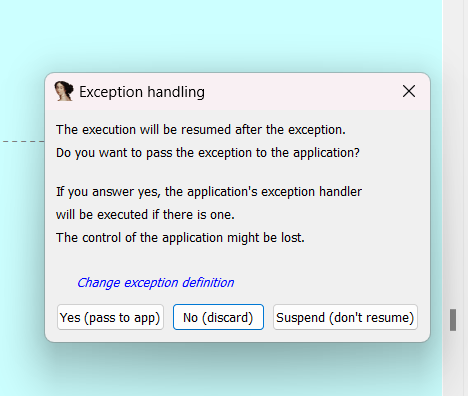

- Nếu phải đánh giá điều gì về chall này, mình nghĩ cái khó ở đây không phải bypass exception bởi các vị trí cần `patch` khá dễ nhận thấy. Điều cản trở việc debug của mình ở chall này là mã giả không cung cấp nhiều thông tin(chương trình gen mã giả không hoàn thiện) khiến nhiều đoạn phải mò và đặt `bp` rồi dần dần nắm được luồng chính.

- Sau quá trình debug, mình rút ra được chương trình sẽ hoạt động như sau.

- Đầu tiên, chương trình kiểm tra ngoại lệ, quăng ra hàm mã hóa khá dài nếu sử dụng debugger. Nếu không sẽ nhảy tới hàm encrypt input.

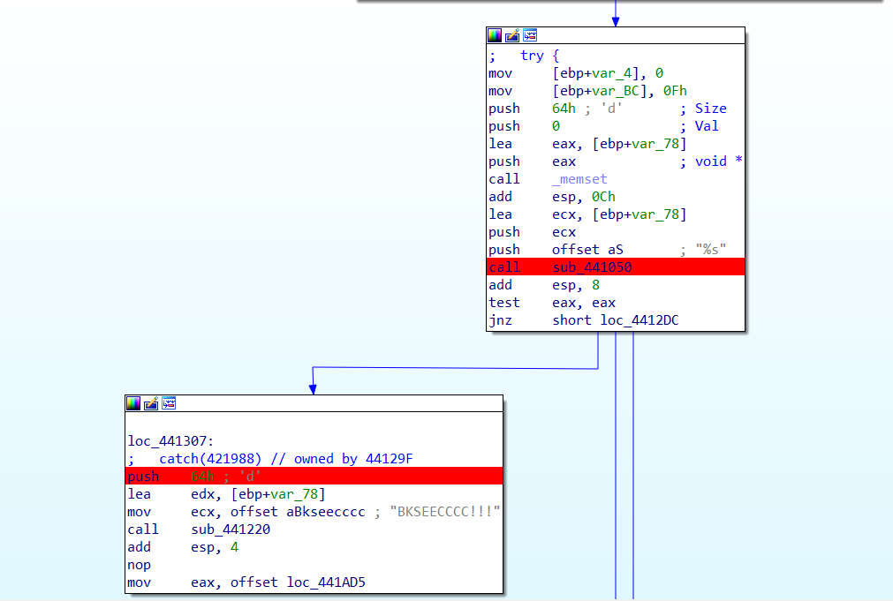

- Hàm mã hóa input khá đơn giản, chỉ gồm phép xor với key là `BKSEECCCC!!!`.

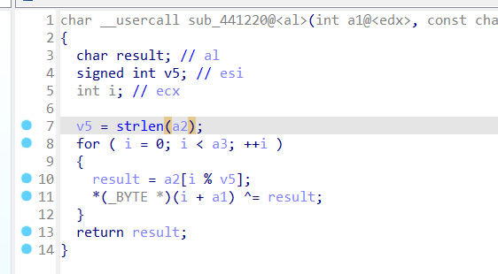

- Sau đó, chương trình nhảy tới hàm kiểm tra dưới đây, và cũng là điểm duy nhất ta cần `patch` để bypass(hoặc cũng không cần vì tới đây hoàn toàn có thể debug tĩnh). Một bên là luồng xử lí rất dài mà mình không nắm rõ khi đoạn này không xuất được mã giả. Luồng còn lại ta thấy một dải data được load vào.

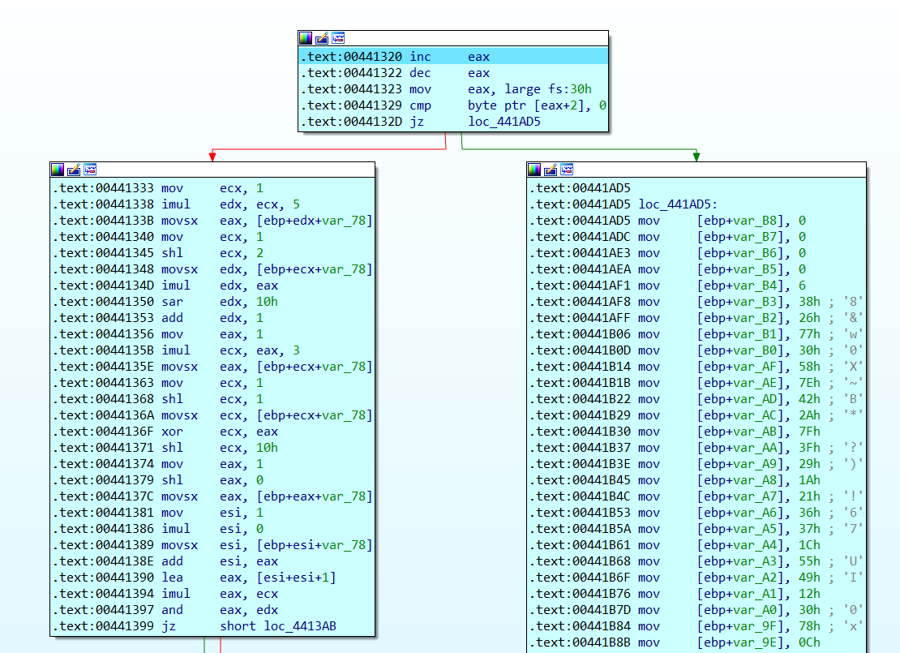

- Vì chương trình đã có `key`, mình mạnh dạn đoán chuỗi này là có thể là chuỗi để kiểm tra với chuỗi input `xor` với key trước đó. Vì đoạn mã hóa chỉ gồm phép `xor`, ta thử viết script ngược lại xem có thật sự ra flag không.

```python
cipher = [0x0, 0x38, 0x7A, 0x6C, 0x2C, 0x37, 0x43, 0x44, 0x45, 0x1C, 0x72, 0x37, 0x2D, 0x24, 0x1A, 0x60, 0x26, 0x2D, 0x52, 0x7E, 0x12, 0x21, 0x1C, 0x37, 0x30, 0x30, 0x28, 0x0C, 0x78, 0x30, 0x12, 0x49, 0x55, 0x1C, 0x37, 0x36, 0x21, 0x1A, 0x29, 0x3F, 0x7F, 0x2A, 0x42, 0x7E, 0x58, 0x30, 0x77, 0x26, 0x38, 0x6, 0x0, 0x0, 0x0, 0x0
          ]
key = "BKSEECCCC!!!"
flag = ""

for i in range(len(cipher)):
    flag += chr(cipher[len(cipher)-i-1] ^ ord(key[i % len(key)]))
print(flag)
print(len(flag))
```

```
  flag: BKSEC{e4sy_ch4ll_but_th3r3_must_b3_som3_ant1_debug??}
```

- Sử dụng flag thu được quăng vào debug xem đoạn nào bắt buộc phải bypass :v. Ta thấy được đoạn này cần patch vì chương trình không nhảy vào đoạn cipher khi debug.

  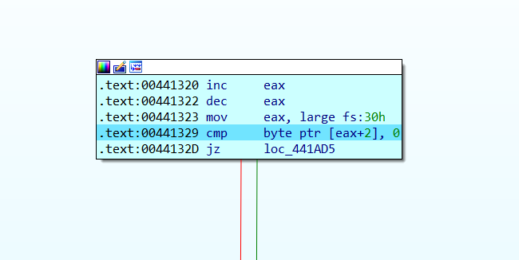

- Thông báo flag chuẩn.

  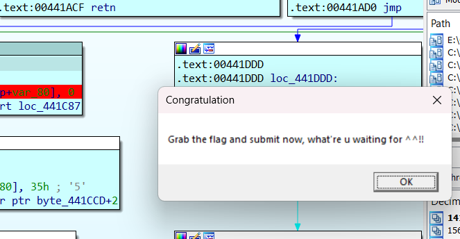

### anti2

- Chall này đã được giảm độ khó vì mình được biết trước rằng vấn đề của chall này là về `anti-debug`, nên mình tập trung tìm kiếm những đoạn có thể gây ảnh hưởng tới luồng chương trình, hoặc những đoạn điều chỉnh giá trị của `cipher`, `key`.

- Lệnh kiểm tra của chương trình vô cùng đơn giản, với `key` là `v22` không đổi, `*v10` -> `*v24`. `v24` được sinh ra trong các đoạn lệnh trên. Debug tới vị trí này, mình lấy ra `v24` và `v22` ra để viết script gen flag nhưng ra chuỗi rác, vậy khả năng cao vấn đề nằm ở quá trình sinh ra cipher(`v24`) bởi `v22` là const.

  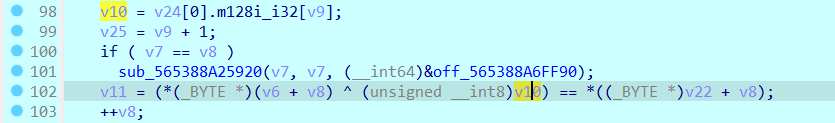

- Mình thấy được trong chương trình có 3 hàm truyền vào `v24`, Từ đó ta sẽ quét qua các đoạn tác động tới `v24`.

  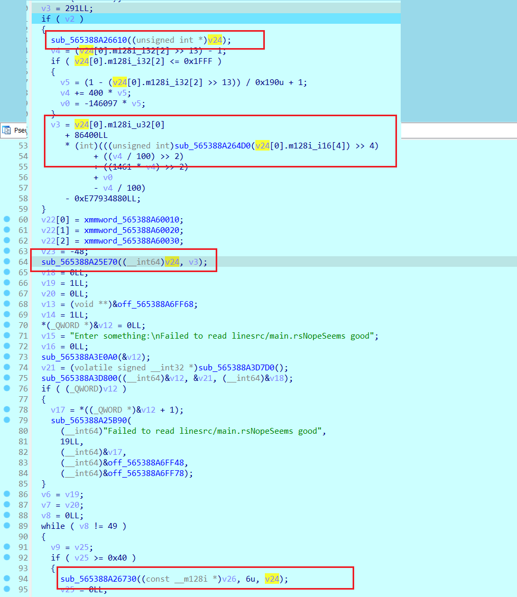

- Sử dụng `IDA` để tiến hành debug, mình thấy được 2 đoạn xử lý khá đáng ngờ. điều kiện `if(v2)` rất đáng chú ý, bởi `v2` là `const`. Việc này khiến ta bắt buộc phải nhảy vào đoạn xử lý trong đó, đồng thời đoạn xử lý này có dòng lệnh `sub_565388A26610((unsigned int *)v24);` tác động tới `v24`.

  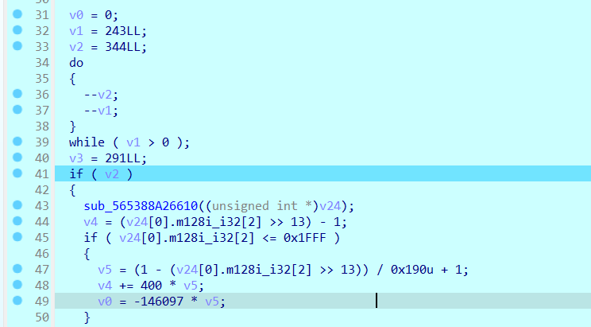

- Mình xem xét hàm `sub_565388A26610()` và thấy trong đó có một hàm sử dụng bộ đếm thời gian - thứ thường xuất hiện trong các chương trình có áp dụng `anti-debug`. Mình quyết định bypass để không nhảy vào đoạn xử lý này.

  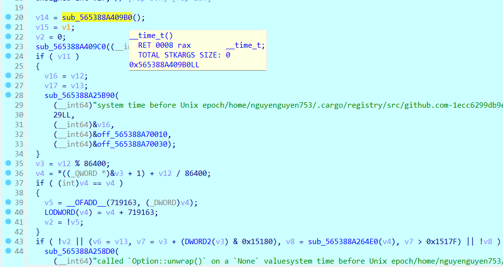

- Tiếp theo là hàm `sub_5642338CFE70((__int64)v24, v3);` với `v24` là đối tượng cần xem xét và v3 được sinh ra từ `v24`(nếu nhảy vào đoạn xử lí trên, nếu không `v3` là const). Tuy nhiên hàm này không có vấn đề gì, bởi một là nó luôn được thực thi khi chạy chương trình, hai là trong hàm chỉ có các đoạn xử lý toán học thông thường. Mình sẽ không tác động tới hàm này.

  

- cuối cùng là `sub_5642338D0730((const __m128i *)v26, 6u, v24);` nằm trong đoạn check với `key`. `sub_5642338D0730()` được gọi ra khi vòng lặp chạy lần đầu, mình suy luận rằng nó là hàm sinh ra `v24` từ dữ liệu trước đó. Và trong hàm này cũng có những đoạn trả về `v24` với `argv` khác khiến `v24` bị thay đổi.

  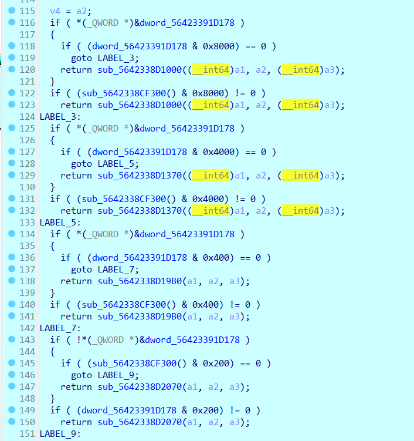

- Khi nhảy tới đây, mình thấy rằng các câu lệnh kiểm tra bên trên luôn check giá trị tại `dword_56423391D178` là `const`, điều này thể hiện `dword_56423391D178` đã bị thay đổi ở đâu đó để dùng vào việc detect debugger. Vì thế mình sẽ bypass toàn bộ các dòng lệnh kiểm tra đó để nhảy xuống đoạn chương trình sinh ra `v24` ngay dưới.

  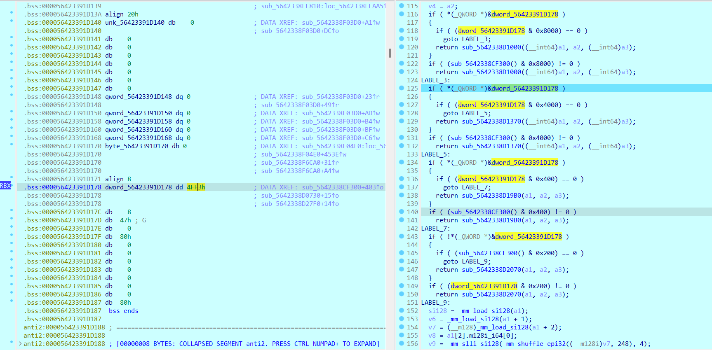

- Cuối cùng thu được `v24`, viết script sinh ra flag. Nếu còn gì cần lưu ý thì đó là kiểu dữ liệu của bước nhảy `v8` là 64bit nên mỗi lần nhảy 4 kí tự, và `v10`->`v24` được ép về `__int8` nên ta cần nhảy 4 kí tự một hoặc and nó với `0xff`. Điều này trong quá trình chạy vòng lặp có thể dễ dàng nhận ra thôi^^.

  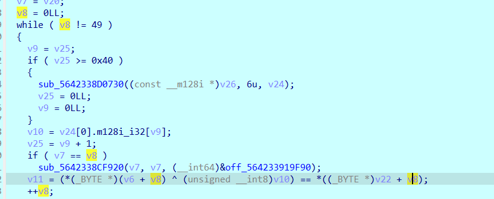

```python
v24 = [0xE8, 0x49, 0x12, 0x6E, 0x4E, 0x47, 0xD8, 0x7A, 0x1B, 0x2E,
       0xC5, 0x8A, 0x19, 0x15, 0xD5, 0x3E, 0x0B, 0x08, 0x91, 0xC5,
       0xC0, 0x79, 0x3E, 0xB8, 0xD8, 0x64, 0x95, 0x4D, 0xD4, 0x22,
       0x54, 0x00, 0x65, 0xBD, 0x83, 0x59, 0x60, 0xB4, 0x4C, 0xC7,
       0x78, 0xC5, 0xBF, 0xE8, 0x4B, 0x7C, 0x35, 0xDA, 0x14, 0xBB,
       0x81, 0xE4, 0x26, 0x70, 0xB7, 0x40, 0x7A, 0x31, 0x5D, 0xD1,
       0x19, 0x84, 0xF0, 0x1D, 0x8C, 0x53, 0xC1, 0xBF, 0x61, 0x4C,
       0x8A, 0x60, 0x16, 0x0A, 0x73, 0x51, 0x37, 0x9F, 0x2A, 0x31,
       0xCC, 0xD8, 0x67, 0x96, 0x22, 0x4C, 0x30, 0x36, 0x9C, 0x0C,
       0x20, 0xF8, 0x08, 0x4E, 0x4E, 0x9F, 0x2F, 0xA9, 0xF3, 0xF0,
       0x4F, 0x85, 0x51, 0xE2, 0x18, 0x79, 0x57, 0xDA, 0xB6, 0x16,
       0x31, 0xBC, 0x2A, 0xA7, 0x09, 0x77, 0x6F, 0xFB, 0xC5, 0xB8,
       0xCB, 0x0D, 0xFB, 0x12, 0x71, 0x42, 0x8A, 0x04, 0x54, 0x67,
       0xD8, 0xF4, 0x22, 0xD9, 0x0C, 0xF4, 0xAA, 0xDB, 0xC1, 0x48,
       0x69, 0x96, 0x0E, 0x19, 0xF6, 0x80, 0xC0, 0xA3, 0x7E, 0x00,
       0x8B, 0xC6, 0xCF, 0xB6, 0xDD, 0x16, 0xF2, 0xCC, 0x57, 0x5B,
       0x4F, 0x86, 0xC8, 0xB2, 0xD3, 0x00, 0x57, 0x6C, 0xC7, 0x50,
       0xBF, 0x44, 0xCC, 0x0B, 0xD0, 0x96, 0x69, 0x18, 0xE6, 0x96,
       0x4D, 0x22, 0xF7, 0x66, 0x9D, 0xAE, 0x3D, 0x1C, 0x0F, 0xE8,
       0x6F, 0x0E, 0xAD, 0x8E, 0xC5, 0xD9, 0xD3, 0xDB, 0x84, 0x4C,
       0x16, 0x41, 0x38, 0xE5, 0x01, 0x0E, 0x3D, 0x5E, 0x65, 0x59,
       0xB2, 0x6E, 0x6C, 0xCF, 0x08, 0x0B, 0x34, 0x27, 0x50, 0x34,
       0x72, 0xF3, 0x69, 0x93, 0x99, 0xDE, 0x07, 0x84, 0x71, 0xEE,
       0xA5, 0xF3, 0x99, 0x42, 0x51, 0xE8, 0xD6, 0x22, 0xE1, 0x00,
       0xC2, 0xF4, 0x9A, 0x68, 0x1D, 0x7C, 0xD7, 0xA9, 0x5C, 0xD2,
       0xA0, 0x5B, 0xD8, 0x57, 0xF3, 0x88, 0x00, 0x00, 0x00, 0x00,
       0x00, 0x00, 0x00, 0x00, 0xB8, 0xB8, 0xDC, 0xD3, 0xAF, 0xA9,
       0x2D, 0xC9]


cipher = [0xBF, 0x7F, 0x60, 0x6B, 0x6E, 0xA1, 0xB4, 0x8B, 0x12, 0x01,
          0x0A, 0x26, 0x4B, 0x53, 0x0A, 0x46, 0xB5, 0x03, 0x22, 0x02,
          0xA9, 0x10, 0xAF, 0x6A, 0x16, 0x78, 0x2C, 0xD3, 0x1D, 0x09,
          0xAF, 0x48, 0x32, 0x46, 0xC8, 0x5B, 0x93, 0x49, 0xA9, 0x96,
          0x7B, 0xE3, 0xF2, 0xF8, 0x0C, 0x74, 0xAB, 0x6C, 0xD0]

flag_comp = 'abcdefghijklmnopqrstuvwxyzABCDEFGHIJKLMNOPQRSTUVWXYZ0123456789!@#$%^&*()_+-=<>,.?/{}[]\|~'

flag = ""

for i in range(49):
    flag += chr(cipher[i] ^ v24[i*4])
print(flag)
```

```
  flag: W1{real_warm_up_9b45e23b974e7fd9fdb2e7fd4054e96c}
```

### anti3

- cuming soon~~

## Mong WRITEUP này giúp ích cho các bạn!

```

from KMA
Author: 13r_ə_Rɪst
Email: sonvha2k23@cvp.vn

```
