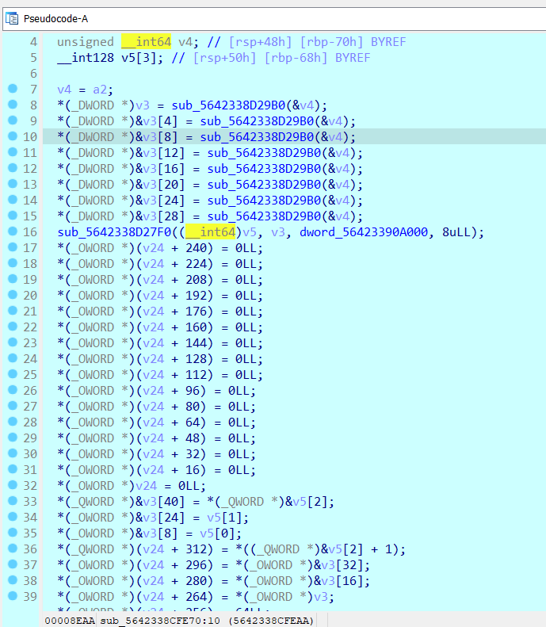
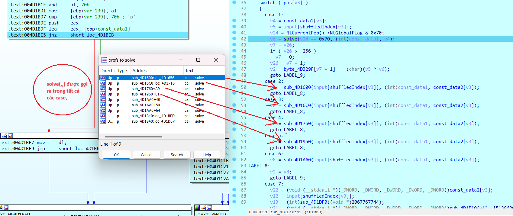
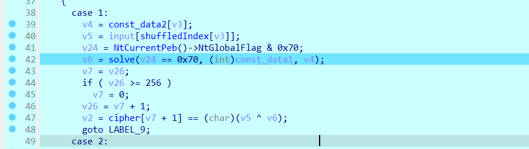
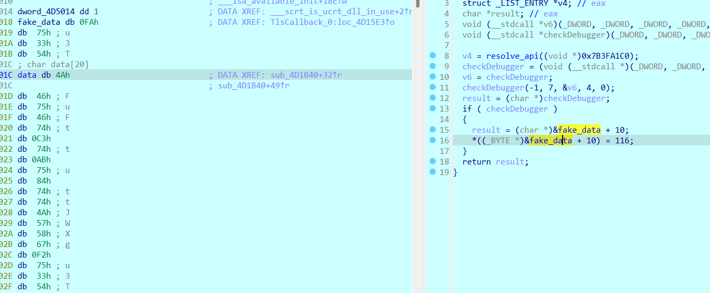
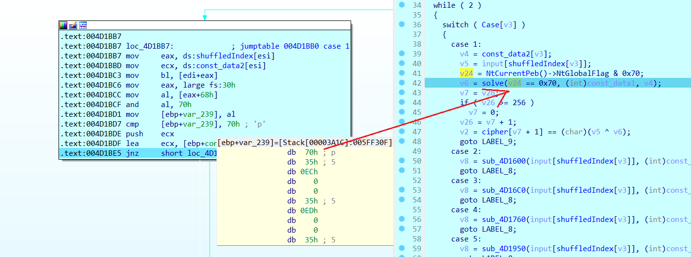
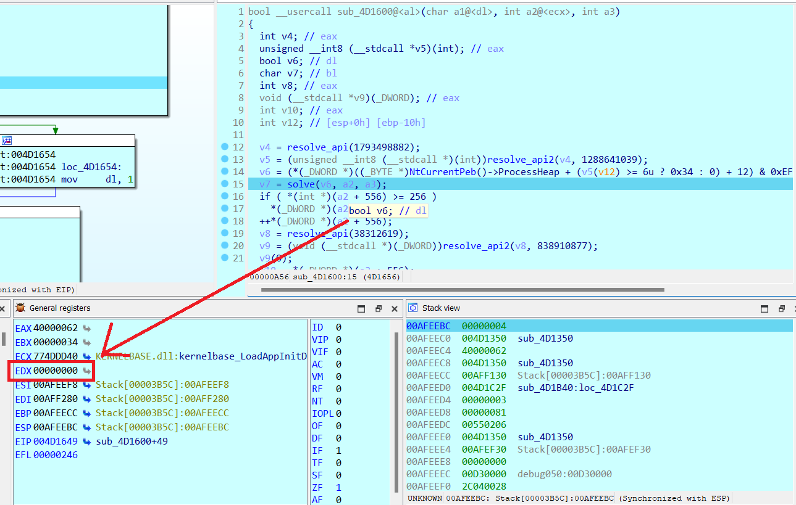
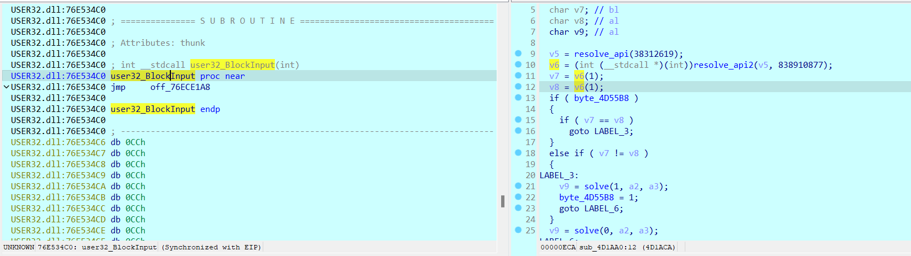
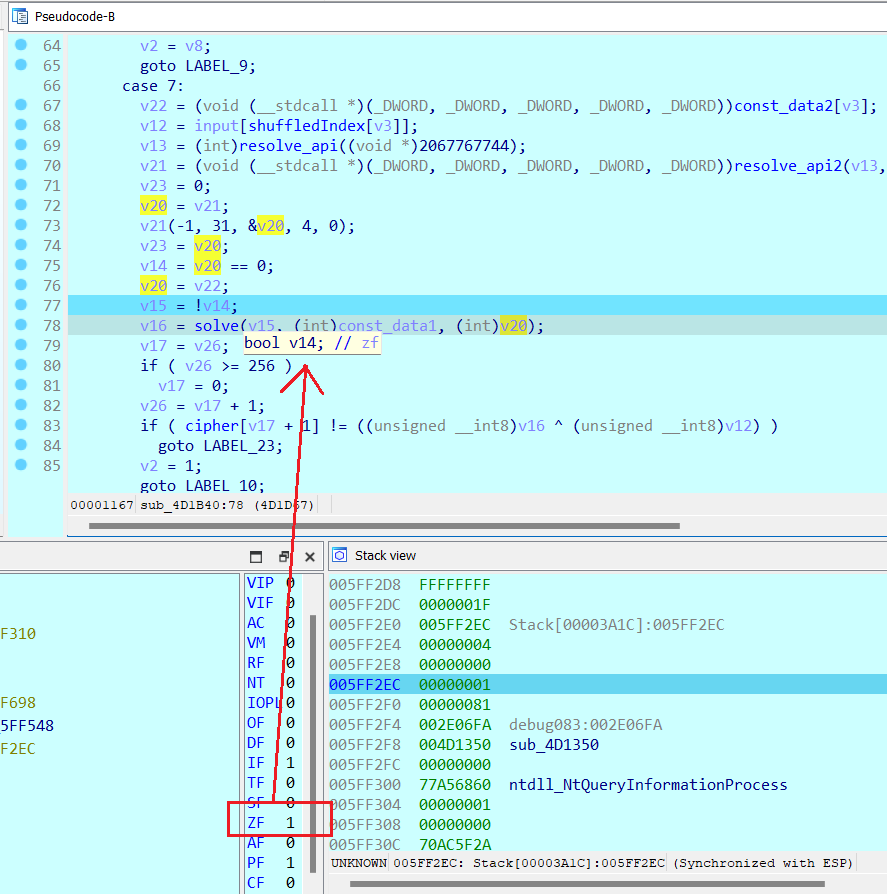

## Task4/ANTI-Debug/EX

### anti1

- Về bài đầu tiên, Chương trình thực hiện antidebug bằng cách `throw exception` khi detect ra chương trình đang được debug và hướng ta tới luồng chương trình sai. Tuy nhiên có vẻ `IDA` quá mạnh cho phép debugger thoát khỏi `exception` và quay trở lại luồng chính khiến việc debug không gặp trở ngại nào.


- Nếu phải đánh giá điều gì về chall này, mình nghĩ cái khó ở đây không phải bypass exception bởi các vị trí cần `patch` khá dễ nhận thấy. Điều cản trở việc debug của mình ở chall này là mã giả không cung cấp nhiều thông tin(chương trình gen mã giả không hoàn thiện) khiến nhiều đoạn phải mò và đặt `bp` rồi dần dần nắm được luồng chính.

- Sau quá trình debug, mình rút ra được chương trình sẽ hoạt động như sau.

- Đầu tiên, chương trình kiểm tra ngoại lệ, quăng ra hàm mã hóa khá dài nếu sử dụng debugger. Nếu không sẽ nhảy tới hàm encrypt input.


- Hàm mã hóa input khá đơn giản, chỉ gồm phép xor với key là `BKSEECCCC!!!`.


- Sau đó, chương trình nhảy tới hàm kiểm tra dưới đây, và cũng là điểm duy nhất ta cần `patch` để bypass(hoặc cũng không cần vì tới đây hoàn toàn có thể debug tĩnh). Một bên là luồng xử lí rất dài mà mình không nắm rõ khi đoạn này không xuất được mã giả. Luồng còn lại ta thấy một dải data được load vào.


- Vì chương trình đã có `key`, mình mạnh dạn đoán chuỗi này là có thể là chuỗi để kiểm tra với chuỗi input `xor` với key trước đó. Vì đoạn mã hóa chỉ gồm phép `xor`, ta thử viết script ngược lại xem có thật sự ra flag không.

```python
cipher = [0x0, 0x38, 0x7A, 0x6C, 0x2C, 0x37, 0x43, 0x44, 0x45, 0x1C, 0x72, 0x37, 0x2D, 0x24, 0x1A, 0x60, 0x26, 0x2D, 0x52, 0x7E, 0x12, 0x21, 0x1C, 0x37, 0x30, 0x30, 0x28, 0x0C, 0x78, 0x30, 0x12, 0x49, 0x55, 0x1C, 0x37, 0x36, 0x21, 0x1A, 0x29, 0x3F, 0x7F, 0x2A, 0x42, 0x7E, 0x58, 0x30, 0x77, 0x26, 0x38, 0x6, 0x0, 0x0, 0x0, 0x0
          ]
key = "BKSEECCCC!!!"
flag = ""

for i in range(len(cipher)):
    flag += chr(cipher[len(cipher)-i-1] ^ ord(key[i % len(key)]))
print(flag)
print(len(flag))
```

```
  flag: BKSEC{e4sy_ch4ll_but_th3r3_must_b3_som3_ant1_debug??}
```

- Sử dụng flag thu được quăng vào debug xem đoạn nào bắt buộc phải bypass :v. Ta thấy được đoạn này cần patch vì chương trình không nhảy vào đoạn cipher khi debug.

  

- Thông báo flag chuẩn.

  

### anti2

- Chall này đã được giảm độ khó vì mình được biết trước rằng vấn đề của chall này là về `anti-debug`, nên mình tập trung tìm kiếm những đoạn có thể gây ảnh hưởng tới luồng chương trình, hoặc những đoạn điều chỉnh giá trị của `cipher`, `key`.

- Lệnh kiểm tra của chương trình vô cùng đơn giản, với `key` là `v22` không đổi, `*v10` -> `*v24`. `v24` được sinh ra trong các đoạn lệnh trên. Debug tới vị trí này, mình lấy ra `v24` và `v22` ra để viết script gen flag nhưng ra chuỗi rác, vậy khả năng cao vấn đề nằm ở quá trình sinh ra cipher(`v24`) bởi `v22` là const.

  

- Mình thấy được trong chương trình có 3 hàm truyền vào `v24`, Từ đó ta sẽ quét qua các đoạn tác động tới `v24`.

  

- Sử dụng `IDA` để tiến hành debug, mình thấy được 2 đoạn xử lý khá đáng ngờ. điều kiện `if(v2)` rất đáng chú ý, bởi `v2` là `const`. Việc này khiến ta bắt buộc phải nhảy vào đoạn xử lý trong đó, đồng thời đoạn xử lý này có dòng lệnh `sub_565388A26610((unsigned int *)v24);` tác động tới `v24`.

  

- Mình xem xét hàm `sub_565388A26610()` và thấy trong đó có một hàm sử dụng bộ đếm thời gian - thứ thường xuất hiện trong các chương trình có áp dụng `anti-debug`. Mình quyết định bypass để không nhảy vào đoạn xử lý này.

  

- Tiếp theo là hàm `sub_5642338CFE70((__int64)v24, v3);` với `v24` là đối tượng cần xem xét và v3 được sinh ra từ `v24`(nếu nhảy vào đoạn xử lí trên, nếu không `v3` là const). Tuy nhiên hàm này không có vấn đề gì, bởi một là nó luôn được thực thi khi chạy chương trình, hai là trong hàm chỉ có các đoạn xử lý toán học thông thường. Mình sẽ không tác động tới hàm này.

  

- cuối cùng là `sub_5642338D0730((const __m128i *)v26, 6u, v24);` nằm trong đoạn check với `key`. `sub_5642338D0730()` được gọi ra khi vòng lặp chạy lần đầu, mình suy luận rằng nó là hàm sinh ra `v24` từ dữ liệu trước đó. Và trong hàm này cũng có những đoạn trả về `v24` với `argv` khác khiến `v24` bị thay đổi.

  

- Khi nhảy tới đây, mình thấy rằng các câu lệnh kiểm tra bên trên luôn check giá trị tại `dword_56423391D178` là `const`, điều này thể hiện `dword_56423391D178` đã bị thay đổi ở đâu đó để dùng vào việc detect debugger. Vì thế mình sẽ bypass toàn bộ các dòng lệnh kiểm tra đó để nhảy xuống đoạn chương trình sinh ra `v24` ngay dưới.

  

- Cuối cùng thu được `v24`, viết script sinh ra flag. Nếu còn gì cần lưu ý thì đó là kiểu dữ liệu của bước nhảy `v8` là 64bit nên mỗi lần nhảy 4 kí tự, và `v10`->`v24` được ép về `__int8` nên ta cần nhảy 4 kí tự một hoặc and nó với `0xff`. Điều này trong quá trình chạy vòng lặp có thể dễ dàng nhận ra thôi^^.

  

```python
v24 = [0xE8, 0x49, 0x12, 0x6E, 0x4E, 0x47, 0xD8, 0x7A, 0x1B, 0x2E,
       0xC5, 0x8A, 0x19, 0x15, 0xD5, 0x3E, 0x0B, 0x08, 0x91, 0xC5,
       0xC0, 0x79, 0x3E, 0xB8, 0xD8, 0x64, 0x95, 0x4D, 0xD4, 0x22,
       0x54, 0x00, 0x65, 0xBD, 0x83, 0x59, 0x60, 0xB4, 0x4C, 0xC7,
       0x78, 0xC5, 0xBF, 0xE8, 0x4B, 0x7C, 0x35, 0xDA, 0x14, 0xBB,
       0x81, 0xE4, 0x26, 0x70, 0xB7, 0x40, 0x7A, 0x31, 0x5D, 0xD1,
       0x19, 0x84, 0xF0, 0x1D, 0x8C, 0x53, 0xC1, 0xBF, 0x61, 0x4C,
       0x8A, 0x60, 0x16, 0x0A, 0x73, 0x51, 0x37, 0x9F, 0x2A, 0x31,
       0xCC, 0xD8, 0x67, 0x96, 0x22, 0x4C, 0x30, 0x36, 0x9C, 0x0C,
       0x20, 0xF8, 0x08, 0x4E, 0x4E, 0x9F, 0x2F, 0xA9, 0xF3, 0xF0,
       0x4F, 0x85, 0x51, 0xE2, 0x18, 0x79, 0x57, 0xDA, 0xB6, 0x16,
       0x31, 0xBC, 0x2A, 0xA7, 0x09, 0x77, 0x6F, 0xFB, 0xC5, 0xB8,
       0xCB, 0x0D, 0xFB, 0x12, 0x71, 0x42, 0x8A, 0x04, 0x54, 0x67,
       0xD8, 0xF4, 0x22, 0xD9, 0x0C, 0xF4, 0xAA, 0xDB, 0xC1, 0x48,
       0x69, 0x96, 0x0E, 0x19, 0xF6, 0x80, 0xC0, 0xA3, 0x7E, 0x00,
       0x8B, 0xC6, 0xCF, 0xB6, 0xDD, 0x16, 0xF2, 0xCC, 0x57, 0x5B,
       0x4F, 0x86, 0xC8, 0xB2, 0xD3, 0x00, 0x57, 0x6C, 0xC7, 0x50,
       0xBF, 0x44, 0xCC, 0x0B, 0xD0, 0x96, 0x69, 0x18, 0xE6, 0x96,
       0x4D, 0x22, 0xF7, 0x66, 0x9D, 0xAE, 0x3D, 0x1C, 0x0F, 0xE8,
       0x6F, 0x0E, 0xAD, 0x8E, 0xC5, 0xD9, 0xD3, 0xDB, 0x84, 0x4C,
       0x16, 0x41, 0x38, 0xE5, 0x01, 0x0E, 0x3D, 0x5E, 0x65, 0x59,
       0xB2, 0x6E, 0x6C, 0xCF, 0x08, 0x0B, 0x34, 0x27, 0x50, 0x34,
       0x72, 0xF3, 0x69, 0x93, 0x99, 0xDE, 0x07, 0x84, 0x71, 0xEE,
       0xA5, 0xF3, 0x99, 0x42, 0x51, 0xE8, 0xD6, 0x22, 0xE1, 0x00,
       0xC2, 0xF4, 0x9A, 0x68, 0x1D, 0x7C, 0xD7, 0xA9, 0x5C, 0xD2,
       0xA0, 0x5B, 0xD8, 0x57, 0xF3, 0x88, 0x00, 0x00, 0x00, 0x00,
       0x00, 0x00, 0x00, 0x00, 0xB8, 0xB8, 0xDC, 0xD3, 0xAF, 0xA9,
       0x2D, 0xC9]


cipher = [0xBF, 0x7F, 0x60, 0x6B, 0x6E, 0xA1, 0xB4, 0x8B, 0x12, 0x01,
          0x0A, 0x26, 0x4B, 0x53, 0x0A, 0x46, 0xB5, 0x03, 0x22, 0x02,
          0xA9, 0x10, 0xAF, 0x6A, 0x16, 0x78, 0x2C, 0xD3, 0x1D, 0x09,
          0xAF, 0x48, 0x32, 0x46, 0xC8, 0x5B, 0x93, 0x49, 0xA9, 0x96,
          0x7B, 0xE3, 0xF2, 0xF8, 0x0C, 0x74, 0xAB, 0x6C, 0xD0]

flag_comp = 'abcdefghijklmnopqrstuvwxyzABCDEFGHIJKLMNOPQRSTUVWXYZ0123456789!@#$%^&*()_+-=<>,.?/{}[]\|~'

flag = ""

for i in range(49):
    flag += chr(cipher[i] ^ v24[i*4])
print(flag)
```

```
  flag: W1{real_warm_up_9b45e23b974e7fd9fdb2e7fd4054e96c}
```

### anti3

- Với sự hỗ trợ toàn diện từ anh Dũng, mình hoàn thành chall này khi xử lý các thông tin được gợi ý^^

- Độ khó của bài này đã được nâng cao, không thể `patch` thiếu trách nhiệm như bài 2 nữa, khi bộ switch/case bắt buộc phải chạy vào để thực hiện biến đổi `cipher`. Điểm khác biệt của các `case` là tham số đầu tiên của hàm `solve(,,)`- biểu thị cho việc detect debugger trong nội dung từng `case`. Hai tham số còn lại của hàm đều là const nên ta chỉ cần nhặt ra để viết `script`.

  

- Cũng may rằng ngoài việc detect debugger kĩ và dày hơn 2 bài trên thì việc gen ra flag lại không khác mấy, mấu chốt vẫn nằm ở phép `xor`. Trong chương trình, input sẽ được check từng kí tự bằng cách so sánh với input. `v2` mang kdl `bool` là kết quả của phép so sánh giữa `cipher[i]` và kết quả của phép toán `input[shuffledIndex[v3]]^solve(0/1,const1,const2)` được đem đi để kiểm tra và tiếp tục vòng lặp 38 lần. với `cipher`, `shuffledIndex` và 2 đối số sau là `const`, mình vạch được ra mục tiêu trong bài này là detect ra tham số đầu tiên của `solve()` rút ra sau mỗi lần bypass công đoạn `antidebug` trong từng `case`.

  

- Trước tiên phải kể đến `TlsCallback`, mình khá ấn tượng về hàm này khi lần đầu đọc WU bài `two_faces`-chall đầu tiên mình gặp có xuất hiện `antidebug`. Nên biết rõ rằng chall nào có antidebug, đây sẽ là hàm mình search đầu tiên^^. Thứ được gọi ra ở đây là `ZwQueryInformationProcess`, hàm này thực hiện kiểm tra thông qua `ProcessDebugPort`, nếu chương trình bị debug, sẽ trả về `0xffffffff`

- Khi check debug thành công, chương trình sẽ thêm một lệnh vào chương trình, thực hiện thay đổi giá trị của mảng `data` thứ được dùng để tạo ra `const_data1` -> ảnh hưởng tới `solve()`. Giải quyết vấn đề bằng cách `patch` để bypass đoạn kiểm tra.

  

- Các đoạn trung gian dẫn đến hàm check Input không có gì đáng nói nên bỏ qua, tới phân tích hàm kiểm tra Input. Mình có viết đoạn chương trình rút gọn nội dung hàm này như sau:

```python
  for(i:0->38)
  {
    if Case[i] == 1:
      tmp = solve(checkdebugger1(),const_data1,const_data2[i])
    else if Case[i] == 2:
      tmp = solve(checkdebugger2(),const_data1,const_data2[i])
    else if Case[i] == 3:
      tmp = solve(checkdebugger3(),const_data1,const_data2[i])
    else if Case[i] == 4:
      tmp = solve(checkdebugger4(),const_data1,const_data2[i])
    else if Case[i] == 5:
      tmp = solve(checkdebugger5(),const_data1,const_data2[i])
    else if Case[i] == 6:
      tmp = solve(checkdebugger6(),const_data1,const_data2[i])
    else if Case[i] == 7:
      tmp = solve(checkdebugger7(),const_data1,const_data2[i])

    if cipher[i] != input[shuffledIndex[i]] ^ tmp
      return 0
  }
  return 1
```

- Ý tưởng giải quyết bài này là mình sẽ lấy giá trị trả về ngược lại hoàn toàn so với chương trình, vì bản thân đang thực hiện debug nên quá trình check debug sẽ luôn cho mình đầu ra trái với mong muốn. Vậy thay vì nhắm đến quá trình check debug của bài toán, mình sẽ focus vào output đầu ra để viết lại chương trình.

- Trước tiên là hàm thao tác checkDebugger của case1, rõ ràng phép so sánh `v24 == 0x70` đã trả về `true` ~ `1`, ta sẽ lấy đầu vào là `0` ngược lại.

  

- Trong case2, biến v6 sau quá trình detect ra giá trị là `0` -> `1`.

  

- case 3, 4, 5 tương tự case2 lần lượt thu được 1, 0, 0 là input đầu của `solve()`

- Trong case6, chương trình detect debugger bằng cách gọi `BlockInput(true)` hai lần, Hàm `BlockInput()` chỉ thực hiện 1 lần, nếu kết quả trả về của 2 lần gọi đều `true`, chứng minh rằng chương trình đang bị debug. Ta suy ra được `v7` luôn khác `v8` dẫn đến chương trình nhảy vào `v9 = solve(0, a2, a3);`. Vậy input đầu của case6 là `1`.

```C++
bool IsHooked ()
{
    BOOL bFirstResult = FALSE, bSecondResult = FALSE;
    __try
    {
        bFirstResult = BlockInput(TRUE);
        bSecondResult = BlockInput(TRUE);
    }
    __finally
    {
        BlockInput(FALSE);
    }
    return bFirstResult && bSecondResult;
}
```



- Trong `case7`, input đầu tiên được truyền vào là `v15` bằng phủ định của `v14` ~ `ZF` tại dòng lệnh này đang bằng `1` -> ta lấy giá trị `0`. `v20` dù được biến đổi lung tung thì sao cùng vẫn được gán lại bằng `v22` ~ `const_data2[v3]` nên không cần xem xét.

  

- Thu thập đủ đầu vào, giờ thì `xor` thôi^^.(nói thế chứ ngồi sửa IDA cho nó ép kiểu đẹp cũng oải :v)

```C++
#include <bits/stdc++.h>
typedef unsigned __int8 _BYTE;
typedef unsigned __int16 _WORD;
typedef unsigned __int32 _DWORD;

using namespace std;

char solve(bool a1, _BYTE *a2, int a3)
{
    int v4;           // esi
    char v6;          // bl
    int v7;           // ecx
    _WORD v8;         // dx
    unsigned int v9;  // edx
    char v10;         // cl
    unsigned int v11; // edx
    _BYTE v12;        // al
    bool v13;         // zf
    _BYTE *v14;       // ecx
    int v15;          // esi
    char v16;         // dl
    int v18;          // [esp+14h] [ebp+8h]

    v4 = a3 - 1;
    v18 = 171;
    v6 = 0;
    do
    {
        if (v4 <= 5)
        {
            if (*(_DWORD *)&a2[4 * v4 + 16])
                v8 = *(_WORD *)&a2[4 * v4 + 16];
            else
                v8 = *(_WORD *)&a2[4 * v4];
            v7 = (v8 >> 1) | (_WORD)(((_WORD)(32 * v8) ^ (v8 ^ (_WORD)(4 * (v8 ^ (2 * v8)))) & 0xFFE0) << 10);
            *(_DWORD *)&a2[4 * v4 + 16] = v7;
        }
        else
        {
            v7 = 0;
        }
        v9 = v7 & 0x7FF;
        v10 = v7 & 7;
        v11 = v9 >> 3;
        if (a1)
            v12 = a2[v11 + 44];
        else
            v12 = ~a2[v11 + 44];
        v13 = v18-- == 1;
        a2[v11 + 44] = v12 ^ (1 << v10);
    } while (!v13);
    v14 = a2 + 46;
    v15 = 64;
    do
    {
        v16 = *(v14 - 2);
        v14 += 4;
        v6 ^= *(v14 - 4) ^ *(v14 - 3) ^ *(v14 - 5) ^ v16;
        --v15;
    } while (v15);
    return v6;
}

_BYTE const_data1[] =
    {
        54, 236, 0, 0, 54, 237, 0, 0, 54, 187,
        0, 0, 54, 140, 0, 0, 0, 0, 0, 0,
        0, 0, 0, 0, 0, 0, 0, 0, 0, 0,
        0, 0, 95, 0, 0, 0, 4, 5, 167, 119,
        152, 19, 205, 0, 0, 0, 0, 0, 0, 0,
        0, 0, 0, 0, 0, 0, 0, 0, 0, 0,
        0, 0, 0, 0, 0, 0, 0, 0, 0, 0,
        0, 0, 0, 0, 0, 0, 0, 0, 0, 0,
        0, 0, 0, 0, 0, 0, 0, 0, 0, 0,
        0, 0, 0, 0, 0, 0, 0, 0, 0, 0,
        0, 0, 0, 0, 0, 0, 0, 0, 0, 0,
        0, 0, 0, 0, 0, 0, 0, 0, 0, 0,
        0, 0, 0, 0, 0, 0, 0, 0, 0, 0,
        0, 0, 0, 0, 0, 0, 0, 0, 0, 0,
        0, 0, 0, 0, 0, 0, 0, 0, 0, 0,
        0, 0, 0, 0, 0, 0, 0, 0, 0, 0,
        0, 0, 0, 0, 0, 0, 0, 0, 0, 0,
        0, 0, 0, 0, 0, 0, 0, 0, 0, 0,
        0, 0, 0, 0, 0, 0, 0, 0, 0, 0,
        0, 0, 0, 0, 0, 0, 0, 0, 0, 0,
        0, 0, 0, 0, 0, 0, 0, 0, 0, 0,
        0, 0, 0, 0, 0, 0, 0, 0, 0, 0,
        0, 0, 0, 0, 0, 0, 0, 0, 0, 0,
        0, 0, 0, 0, 0, 0, 0, 0, 0, 0,
        0, 0, 0, 0, 0, 0, 0, 0, 0, 0,
        0, 0, 0, 0, 0, 0, 0, 0, 0, 0,
        0, 0, 0, 0, 0, 0, 0, 0, 0, 0,
        0, 0, 0, 0, 0, 0, 0, 0, 0, 0,
        0, 0, 0, 0, 0, 0, 0, 0, 0, 0,
        0, 0, 0, 0, 0, 0, 0, 0, 0, 0,
        0, 0, 0, 0, 0, 0, 0, 0, 0, 0,
        0, 0, 0, 0, 0, 0, 0, 0, 0, 0,
        0, 0, 0, 0, 0, 0, 0, 0, 0, 0,
        0, 0, 0, 0, 0, 0, 0, 0, 0, 0,
        0, 0, 0, 0, 0, 0, 0, 0, 0, 0,
        0, 0, 0, 0, 0, 0, 0, 0, 0, 0,
        0, 0, 0, 0, 0, 0, 0, 0, 0, 0,
        0, 0, 0, 0, 0, 0, 0, 0, 0, 0,
        0, 0, 0, 0, 0, 0, 0, 0, 0, 0,
        0, 0, 0, 0, 0, 0, 0, 0, 0, 0,
        0, 0, 0, 0, 0, 0, 0, 0, 0, 0,
        0, 0, 0, 0, 0, 0, 0, 0, 0, 0,
        0, 0, 0, 0, 0, 0, 0, 0, 0, 0,
        0, 0, 0, 0, 0, 0, 0, 0, 0, 0,
        0, 0, 0, 0, 0, 0, 0, 0, 0, 0,
        0, 0, 0, 0, 0, 0, 0, 0, 0, 0,
        0, 0, 0, 0, 0, 0, 0, 0, 0, 0,
        0, 0, 0, 0, 0, 0, 0, 0, 0, 0,
        0, 0, 0, 0, 0, 0, 0, 0, 0, 0,
        0, 0, 0, 0, 0, 0, 0, 0, 0, 0,
        0, 0, 0, 0, 0, 0, 0, 0, 0, 0,
        0, 0, 0, 0, 0, 0, 0, 0, 0, 0,
        0, 0, 0, 0, 0, 0, 0, 0, 0, 0,
        0, 0, 0, 0, 0, 0, 0, 0, 0, 0,
        0, 0, 0, 0, 0, 0, 0, 0, 0, 0,
        0, 0, 0, 0, 0, 0};
int const_data2[] =
    {
        1, 0, 0, 0, 3, 0, 0, 0, 1, 0,
        0, 0, 1, 0, 0, 0, 2, 0, 0, 0,
        1, 0, 0, 0, 3, 0, 0, 0, 1, 0,
        0, 0, 2, 0, 0, 0, 2, 0, 0, 0,
        4, 0, 0, 0, 4, 0, 0, 0, 1, 0,
        0, 0, 3, 0, 0, 0, 4, 0, 0, 0,
        4, 0, 0, 0, 4, 0, 0, 0, 1, 0,
        0, 0, 2, 0, 0, 0, 1, 0, 0, 0,
        4, 0, 0, 0, 1, 0, 0, 0, 4, 0,
        0, 0, 3, 0, 0, 0, 1, 0, 0, 0,
        2, 0, 0, 0, 4, 0, 0, 0, 4, 0,
        0, 0, 2, 0, 0, 0, 2, 0, 0, 0,
        1, 0, 0, 0, 3, 0, 0, 0, 4, 0,
        0, 0, 2, 0, 0, 0, 1, 0, 0, 0,
        2, 0, 0, 0, 2, 0, 0, 0, 3, 0,
        0, 0};

int shuffledIndex[] =
    {
        9, 0, 0, 0, 18, 0, 0, 0, 15, 0,
        0, 0, 3, 0, 0, 0, 4, 0, 0, 0,
        23, 0, 0, 0, 6, 0, 0, 0, 7, 0,
        0, 0, 8, 0, 0, 0, 22, 0, 0, 0,
        10, 0, 0, 0, 11, 0, 0, 0, 33, 0,
        0, 0, 13, 0, 0, 0, 14, 0, 0, 0,
        27, 0, 0, 0, 16, 0, 0, 0, 37, 0,
        0, 0, 17, 0, 0, 0, 19, 0, 0, 0,
        20, 0, 0, 0, 21, 0, 0, 0, 5, 0,
        0, 0, 34, 0, 0, 0, 24, 0, 0, 0,
        25, 0, 0, 0, 26, 0, 0, 0, 2, 0,
        0, 0, 12, 0, 0, 0, 29, 0, 0, 0,
        30, 0, 0, 0, 31, 0, 0, 0, 32, 0,
        0, 0, 28, 0, 0, 0, 0, 0, 0, 0,
        35, 0, 0, 0, 36, 0, 0, 0, 1, 0,
        0, 0};

int pos[] =
    {
        6, 0, 0, 0, 1, 0, 0, 0, 7, 0,
        0, 0, 1, 0, 0, 0, 3, 0, 0, 0,
        2, 0, 0, 0, 4, 0, 0, 0, 3, 0,
        0, 0, 6, 0, 0, 0, 3, 0, 0, 0,
        7, 0, 0, 0, 6, 0, 0, 0, 1, 0,
        0, 0, 4, 0, 0, 0, 7, 0, 0, 0,
        4, 0, 0, 0, 1, 0, 0, 0, 5, 0,
        0, 0, 7, 0, 0, 0, 6, 0, 0, 0,
        7, 0, 0, 0, 5, 0, 0, 0, 6, 0,
        0, 0, 4, 0, 0, 0, 5, 0, 0, 0,
        1, 0, 0, 0, 7, 0, 0, 0, 5, 0,
        0, 0, 2, 0, 0, 0, 3, 0, 0, 0,
        1, 0, 0, 0, 2, 0, 0, 0, 3, 0,
        0, 0, 2, 0, 0, 0, 1, 0, 0, 0,
        6, 0, 0, 0, 2, 0, 0, 0, 4, 0,
        0, 0};

int key[] =
    {
        0x0E, 0xEB, 0xF3, 0xF6, 0xD1, 0x6B, 0xA7, 0x8F, 0x3D, 0x91,
        0x85, 0x2B, 0x86, 0xA7, 0x6B, 0xDB, 0x7B, 0x6E, 0x89, 0x89,
        0x18, 0x95, 0x67, 0xCA, 0x5F, 0xE2, 0x54, 0x0E, 0xD3, 0x3E,
        0x20, 0x5A, 0x7E, 0xD4, 0xB8, 0x10, 0xC2, 0xB7, 0x00, 0x00};

char flag[40];

int main()
{
    for (int i = 0; i < 38; ++i)
    {
        if (pos[i * 4] == 1)
            flag[shuffledIndex[i * 4]] = char(key[i] ^ solve(0, const_data1, const_data2[i * 4]));
        else if (pos[i * 4] == 2)
            flag[shuffledIndex[i * 4]] = char(key[i] ^ solve(1, const_data1, const_data2[i * 4]));
        else if (pos[i * 4] == 3)
            flag[shuffledIndex[i * 4]] = char(key[i] ^ solve(1, const_data1, const_data2[i * 4]));
        else if (pos[i * 4] == 4)
            flag[shuffledIndex[i * 4]] = char(key[i] ^ solve(0, const_data1, const_data2[i * 4]));
        else if (pos[i * 4] == 5)
            flag[shuffledIndex[i * 4]] = char(key[i] ^ solve(0, const_data1, const_data2[i * 4]));
        else if (pos[i * 4] == 6)
            flag[shuffledIndex[i * 4]] = char(key[i] ^ solve(1, const_data1, const_data2[i * 4]));
        else if (pos[i * 4] == 7)
            flag[shuffledIndex[i * 4]] = char(key[i] ^ solve(1, const_data1, const_data2[i * 4]));
    }
    cout << flag << endl;
}
```

## Mong WRITEUP này giúp ích cho các bạn!

```

from KMA
Author: 13r_ə_Rɪst
Email: sonvha2k23@cvp.vn

```
