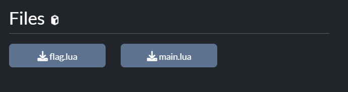

## SubTask/ttvBKsec

### Jslock


- Bài warmup có nội dung như dưới, yêu cầu ta phải nhập mật khẩu gồm 5 số nguyên trong khoảng 0-9.

```js
// Check password here
const correctPassword = [10, 12, 10, 11, 11];

function checkPassword() {
  const dials = document.querySelectorAll(".dial");
  const enteredPassword = Array.from(dials).map((dial) => Number(dial.value));
  const decodedPassword = [
    enteredPassword[0] + enteredPassword[1] + enteredPassword[2],
    enteredPassword[1] + enteredPassword[2] + enteredPassword[3],
    enteredPassword[2] + enteredPassword[3] + enteredPassword[4],
    enteredPassword[3] + enteredPassword[4] + enteredPassword[0],
    enteredPassword[4] + enteredPassword[0] + enteredPassword[1],
  ];
  if (JSON.stringify(decodedPassword) === JSON.stringify(correctPassword)) {
    const passwordString = enteredPassword.join("");
    const hexPassword = new TextEncoder()
      .encode(passwordString)
      .reduce((prev, curr) => prev + curr.toString(16).padStart(2, "0"), "");
    const base64Password = btoa(hexPassword);
    alert("Mở khóa thành công! Cờ của bạn là BKSEC{" + base64Password + "}");
  } else {
    alert("Mật khẩu không chính xác. Vui lòng thử lại.");
  }
}
```

- Giải hệ phương trình 5 ẩn bằng z3.

```python
from z3 import *

a1 = Int('a1')
a2 = Int('a2')
a3 = Int('a3')
a4 = Int('a4')
a5 = Int('a5')

solve(a1 + a2 + a3 == 10, a2 + a3 + a4 == 12, a3 + a4 +
      a5 == 10, a4 + a5 + a1 == 11, a5 + a1 + a2 == 11)
```


```
    flag: BKSEC{MzMzNTMyMzUzMw==}
```


### Jslockpremium

- Nội dung bài 2 tương tự bài 1, nhưng độ khó cao hơn chút.

```js
// Check password here
const correctPassword = [
  43490, 822, 2243, 1105, 4652, 429, 1187, 3901, 395, 1067, 622, 457901,
];

function checkPassword() {
  const dials = document.querySelectorAll(".dial");
  const enteredPassword = Array.from(dials).map((dial) => Number(dial.value));
  const decodedPassword = [
    enteredPassword[0] * enteredPassword[1] - 2 * enteredPassword[2],
    enteredPassword[1] + 5 * enteredPassword[2] - 3 * enteredPassword[3],
    enteredPassword[2] +
      enteredPassword[3] * enteredPassword[4] -
      enteredPassword[0],
    enteredPassword[5] + 2 * enteredPassword[4] + enteredPassword[2],
    20 * enteredPassword[1] - 2 * enteredPassword[2] - enteredPassword[4],
    enteredPassword[2] + enteredPassword[5] - 2 * enteredPassword[1],
    2 * enteredPassword[1] +
      enteredPassword[2] +
      3 * enteredPassword[6] +
      4 * enteredPassword[7],
    5 * enteredPassword[5] -
      enteredPassword[7] -
      enteredPassword[8] +
      2 * enteredPassword[9],
    3 * enteredPassword[8] +
      2 * enteredPassword[9] +
      4 * enteredPassword[10] -
      3 * enteredPassword[6],
    9 * enteredPassword[11] + 2 * enteredPassword[10] - enteredPassword[8],
    4 * enteredPassword[7] - enteredPassword[8] + enteredPassword[10],
    enteredPassword[3] ** enteredPassword[8] +
      3 * enteredPassword[11] -
      2 * enteredPassword[7] +
      enteredPassword[6] +
      enteredPassword[5] +
      enteredPassword[10],
  ];
  if (JSON.stringify(decodedPassword) === JSON.stringify(correctPassword)) {
    const passwordString = enteredPassword.join("");
    const hexPassword = new TextEncoder()
      .encode(passwordString)
      .reduce((prev, curr) => prev + curr.toString(16).padStart(2, "0"), "");
    const base64Password = btoa(hexPassword);
    alert("Mở khóa thành công! Cờ của bạn là BKSEC{" + base64Password + "}");
  } else {
    alert("Mật khẩu không chính xác. Vui lòng thử lại.");
  }
}
```

- Ta cần giải hệ phương trình 12 ẩn với giới hạn các biến nằm trong khoảng 0-999.


- Vấn đề ở đây là trong phương trình cuối cùng ta có một phép lũy thừa `enteredPassword[3] ** enteredPassword[8]` khiến cho `z3` không thể giải được. Vậy để giải chall này, hướng đi cửa mình là cần khử lũy thừa rồi brute-forces.

- Khi quan sát, mình nhận thấy 6 phương trình đầu hoàn toàn phụ thuộc vào nhau. Tức là mình có thể giải riêng hệ 6 để lấy được 6 nghiệm đầu.

```python
from z3 import *

correctPassword = [43490, 822, 2243, 1105, 4652,
                   429, 1187, 3901, 395, 1067, 622, 457901]
enteredPassword0 = Int('enteredPassword0')
enteredPassword1 = Int('enteredPassword1')
enteredPassword2 = Int('enteredPassword2')
enteredPassword3 = Int('enteredPassword3')
enteredPassword4 = Int('enteredPassword4')
enteredPassword5 = Int('enteredPassword5')
enteredPassword6 = Int('enteredPassword6')
enteredPassword7 = Int('enteredPassword7')
enteredPassword8 = Int('enteredPassword8')
enteredPassword9 = Int('enteredPassword9')
enteredPassword10 = Int('enteredPassword10')
enteredPassword11 = Int('enteredPassword11')

# enteredPassword = [0, 0, 0, 0, 0, 0, 0, 0, 0, 0, 0, 0]
# print(len(enteredPassword))


# giải ra 6 nghiệm đầu
solve(enteredPassword0 * enteredPassword1 - 2 * enteredPassword2 == 43490, enteredPassword1 + 5 * enteredPassword2 - 3 * enteredPassword3 == 822, enteredPassword2 + enteredPassword3 * enteredPassword4 - enteredPassword0 ==
      2243, enteredPassword5 + 2 * enteredPassword4 + enteredPassword2 == 1105, 20 * enteredPassword1 - 2 * enteredPassword2 - enteredPassword4 == 4652, enteredPassword2 + enteredPassword5 - 2 * enteredPassword1 == 429)
```


- Sau đó là vét cạn `enteredPassword8` trong khoảng 0-999. Đồng thời giới hạn các giá trị trong khoảng 0-999 để nhận được bộ giá trị hợp lệ.

```python
from z3 import *

correctPassword = [43490, 822, 2243, 1105, 4652,
                   429, 1187, 3901, 395, 1067, 622, 457901]
enteredPassword0 = Int('enteredPassword0')
enteredPassword1 = Int('enteredPassword1')
enteredPassword2 = Int('enteredPassword2')
enteredPassword3 = Int('enteredPassword3')
enteredPassword4 = Int('enteredPassword4')
enteredPassword5 = Int('enteredPassword5')
enteredPassword6 = Int('enteredPassword6')
enteredPassword7 = Int('enteredPassword7')
enteredPassword8 = Int('enteredPassword8')
enteredPassword9 = Int('enteredPassword9')
enteredPassword10 = Int('enteredPassword10')
enteredPassword11 = Int('enteredPassword11')

# enteredPassword = [0, 0, 0, 0, 0, 0, 0, 0, 0, 0, 0, 0]
# print(len(enteredPassword))

# giải ra 6 nghiệm đầu
solve(enteredPassword0 * enteredPassword1 - 2 * enteredPassword2 == 43490, enteredPassword1 + 5 * enteredPassword2 - 3 * enteredPassword3 == 822, enteredPassword2 + enteredPassword3 * enteredPassword4 - enteredPassword0 ==
      2243, enteredPassword5 + 2 * enteredPassword4 + enteredPassword2 == 1105, 20 * enteredPassword1 - 2 * enteredPassword2 - enteredPassword4 == 4652, enteredPassword2 + enteredPassword5 - 2 * enteredPassword1 == 429)

for i in range(0, 1000):
    solve(2 * 250 + 130 + 3 * enteredPassword6 + 4 * enteredPassword7 == correctPassword[6],
          5 * 799 - enteredPassword7 -
          enteredPassword8 + 2 * enteredPassword9 == correctPassword[7],
          3 * enteredPassword8 + 2 * enteredPassword9 +
          4 * enteredPassword10 - 3 *
          enteredPassword6 == correctPassword[8],
          9 * enteredPassword11 + 2 *
          enteredPassword10 - enteredPassword8 == correctPassword[9],
          4 * enteredPassword7 - enteredPassword8 +
          enteredPassword10 == correctPassword[10],
          26 ** i + 3 * enteredPassword11 - 2 * enteredPassword7 + enteredPassword6 + 799 + enteredPassword10 == correctPassword[11], enteredPassword7 >= 0, enteredPassword6 >= 0, enteredPassword8 >= 0, enteredPassword9 >= 0, enteredPassword10 >= 0, enteredPassword11 >= 0)
```


```
    flag: BKSEC{MzEzNzM1MzIzNTMwMzEzMzMwMzIzNjM4MzgzNzM5MzkzNzMxMzMzNDM0MzIzMjM5MzAzOTM5}
```


### Baby IDA 1

- Quăng file thực thi vào `IDA` ta thu được 2 mẩu flag, mẩu thứ 2 được chương trình đọc ngược từ đuôi.


```python
flag1 = 'BKSEC{rev3r5e_r@t'
flag2 = '})12387642t234g789_UaD_t3h_@Uhc}eheh_n0ul_1Uv_Al_'[::-1]
print(flag1+flag2)
```

```
    flag: BKSEC{rev3r5e_r@t_lA_vU1_lu0n_hehe}chU@_h3t_DaU_987g432t24678321)}
```

### Babylua

- Chương trình cấp cho ta 2 file.



- `main.lua` khá dễ đọc, chương trình gọi hàm check với đối số là `flag` và chuỗi `ThisIsAFlag` đóng vai trò là key, khả năng cao hàm check này sẽ nằm trong file `flag.lua`.


- `flag.lua` là file `bin`, sau khi decompile nó, ta có đoạn chương trình như dưới.


- Nếu các bạn cần công cụ để decompile, thì cài  và dùng lệnh `java -jar unlua.jar flag.lua > yourfile.lua`


- hàm check được gọi ra ở `main.lua` được thấy chỉ gồm phép xor và cộng, cuối cùng là check từng kí tự với mảng giá trị được khai báo trên. Dưới đây là script để vét cạn.

```python
arr = [22, 101, 133, 137, 79, 75, 166, 157, 189, 57, 172, 155, 144, 91,
       137, 222, 52, 144, 211, 101, 114, 116, 121, 76, 154, 168, 83, 94]
key = 'ThisIsAFlag'
flag_comp = 'abcdefghijklmnopqrstuvwxyzABCDEFGHIJKLMNOPQRSTUVWXYZ0123456789!@#$%^&*()_+-=<>,.?/{}[]\|~:;"\''

flag = ""
preChar = 0

for i in range(len(arr)):
    for j in flag_comp:
        tmp = ord(j) ^ ord(key[i % len(key)])
        tmp = tmp + preChar
        if tmp == arr[i]:
            flag += j
            preChar = ord(j)
            break
print(flag)
```

```
    flag: BKSEC{ju$t_h@rd3r_2_re@d_:P}
```

### BabyRust

- Để giải chall này, mình cần một phương án tiếp cận khác thay vì theo dõi luồng chương trình để nhặt thông tin như bình thường. Bởi chương trình `rust` khá khó đọc làm ảnh hưởng tới quá trình theo dõi. Tuy nhiên, với thông báo như dưới ta có thể từ string `Wrong! Please try again~` mà dò ra hàm kiểm tra.


- Mình trace ra chuỗi thông báo true/false.


- Nhảy tới, và thấy nội dung hàm như sau


- Đã có thông báo true/false có nghĩa là hàm kiểm tra đã được chạy trước đó, nhảy tới hàm `chall::check::h428e27b3168ba563();`. Tới đây thì đơn giản rồi, có thể thấy được ở mục `Graph Overview` là các `block` check từng kí tự liên tục.


- Nhặt từng kí tự ra và dịch sang `ascii`, ta thu được flag.

```asm
cmp     byte ptr [rax], 42h ;'B'
cmp     byte ptr [rax+1], 4Bh ; 'K'
cmp     byte ptr [rax+2], 53h
cmp     byte ptr [rax+3], 45h
cmp     byte ptr [rax+4], 43h
cmp     byte ptr [rax+5], 7Bh
cmp     byte ptr [rax+6], 77h
cmp     byte ptr [rax+7], 33h
cmp     byte ptr [rax+8], 6Ch ; 'l
cmp     byte ptr [rax+9], 43h ; 'C'
cmp     byte ptr [rax+0Ah], 30h ; '0'
cmp     byte ptr [rax+0Bh], 6Dh ; 'm'
cmp     byte ptr [rax+0Ch], 45h
cmp     byte ptr [rax+0Dh], 5Fh ; '_'
cmp     byte ptr [rax+14], 74h ; 't'
cmp     byte ptr [rax+0Fh], 4Fh ; 'O'
cmp     byte ptr [rax+10h], 5Fh ; '_'
cmp     byte ptr [rax+11h], 52h
cmp     byte ptr [rax+12h], 33h ; '3'
cmp     byte ptr [rax+13h], 76h
cmp     byte ptr [rax+14h], 7Dh
```

```python
flag = [0x42, 0x4B, 0x53, 0x45, 0x43, 0x7B, 0x77, 0x33, 0x6C, 0x43,
        0x30, 0x6D, 0x45, 0x5F, 0x74, 0x4F, 0x5F, 0x52, 0x33, 0x76, 0x7D]
ans = ''
for i in flag:
    ans += chr(i)
print(ans)
```

```
  flag: BKSEC{w3lC0mE_tO_R3v}
```

- Mặc dù đúng nhưng trông khá giống fakeflag :v.

### BabyASM

- Chall cấp cho ta input 0xabcd1456, 0xdfed7768, 0x68686868 và hỏi rằng với chúng thì hàm bên dưới trả về kết quả là?

```asm
babyasm:
	push   ebp
	mov    ebp,esp
	xor    eax,eax
	mov    ah,BYTE [ebp+0x9]
	shl    ax,0x10
	sub    al,BYTE [ebp+0xe]
	add    ah,BYTE [ebp+0xf]
	xor    ax,WORD [ebp+0x12]
	nop
	pop    ebp
ret
```

- Mới đầu mình cũng không rõ input nghĩa là gì bởi hệ thống hàm trong asm không có tham số như các ngôn ngữ bậc cao. Nhưng xem xét kĩ một chút, các phép toán ở dưới đều sử dụng thanh ghi `ebp` để truyền vào các thanh ghi 8bit của `eax` nhằm thực hiện tính toán. Vậy mình đoán rằng các giá trị trên đều được `push` vào `stack` trước khi gọi hàm bởi `ebp` cũng đã trỏ vào cùng một vị trí của `esp` trong lệnh `mov    ebp, esp`, mà `esp` trỏ tới đỉnh stack.

- Một lưu ý rằng các cơ chế hoạt động LIFO của stack. Nếu thứ tự các biến đề bài cho là chuẩn thì việc truy cập của `ebp` là thứ cần lưu ý. Giá trị đầu tiên trong 3 giá trị được push vào sẽ được xếp dưới cùng, ảnh hưởng tới việc truy cập của `ebp`.

- Với mảng 3 giá trị ta có là `[0xabcd1456, 0xdfed7768, 0x68686868]`, nếu muốn `ebp` truy cập đúng theo thứ tự này như đoạn chương trình trên, ta sẽ phải push theo thứ tự ngược lại, khi đó thứ tự truy cập của `ebp` cũng không bị ảnh hưởng.


```asm
section .text
	global _start

_start:
	push 0x68686868
	push 0xdfed7768
	push 0xabcd1456
	call babyasm

	call _exit

_exit:
	mov eax,0x1
	int 0x80

babyasm:
	push   ebp
	mov    ebp,esp
	xor    eax,eax
	mov    ah,BYTE [ebp+0x9]
	shl    ax,0x10
	sub    al,BYTE [ebp+0xe]
	add    ah,BYTE [ebp+0xf]
	xor    ax,WORD [ebp+0x12]
	nop
	pop    ebp
ret
```

- Chạy chương trình trên ở `gdb`, ta thu được output nằm trong `eax` là 0xb77b khi kết thúc hàm.


```
flag: BKSEC{0xb77b}
```

## Mong WRITEUP này giúp ích cho các bạn!

```

from KMA
Author: 13r_ə_Rɪst
Email: sonvha2k23@cvp.vn

```
